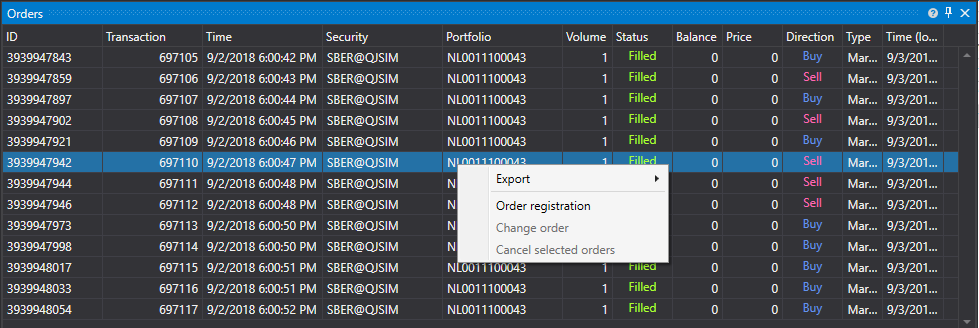

# Orders

[OrderGrid](xref:StockSharp.Xaml.OrderGrid) \- the table to display orders. In addition, the context menu of this table contains commands for operations with orders: registration, replacement and cancellation of orders. Selecting a menu item leads to the generation of events: [OrderGrid.OrderRegistering](xref:StockSharp.Xaml.OrderGrid.OrderRegistering), [OrderGrid.OrderReRegistering](xref:StockSharp.Xaml.OrderGrid.OrderReRegistering) or [OrderGrid.OrderCanceling](xref:StockSharp.Xaml.OrderGrid.OrderCanceling) respectively.



> [!TIP]
> The operation itself (registration, replacement, cancellation) is not performed. The appropriate code must be written in the event handlers independently.

**Main members**

- [OrderGrid.Orders](xref:StockSharp.Xaml.OrderGrid.Orders) \- the list of orders.
- [OrderGrid.SelectedOrder](xref:StockSharp.Xaml.OrderGrid.SelectedOrder) \- the selected order.
- [OrderGrid.SelectedOrders](xref:StockSharp.Xaml.OrderGrid.SelectedOrders) \- \- selected orders.
- [OrderGrid.AddRegistrationFail](xref:StockSharp.Xaml.OrderGrid.AddRegistrationFail(StockSharp.BusinessEntities.OrderFail))**(**[StockSharp.BusinessEntities.OrderFail](xref:StockSharp.BusinessEntities.OrderFail) fail **)** \- the method that adds a message about order registration error in the comment field.
- [OrderGrid.OrderRegistering](xref:StockSharp.Xaml.OrderGrid.OrderRegistering) \- the order registration event (occurs after selecting the appropriate item in the context menu).
- [OrderGrid.OrderReRegistering](xref:StockSharp.Xaml.OrderGrid.OrderReRegistering) \- the order replacement event (occurs after selecting the appropriate item in the context menu).
- [OrderGrid.OrderCanceling](xref:StockSharp.Xaml.OrderGrid.OrderCanceling) \- the order cancellation (occurs after selecting the appropriate item in the context menu).

Below is the code snippet with its use. The code example is taken from *Samples\/InteractiveBrokers\/SampleIB*. 

```xaml
<Window x:Class="Sample.OrdersWindow"
    xmlns="http://schemas.microsoft.com/winfx/2006/xaml/presentation"
    xmlns:x="http://schemas.microsoft.com/winfx/2006/xaml"
    xmlns:loc="clr-namespace:StockSharp.Localization;assembly=StockSharp.Localization"
    xmlns:xaml="http://schemas.stocksharp.com/xaml"
    Title="{x:Static loc:LocalizedStrings.Orders}" Height="410" Width="930">
	<xaml:OrderGrid x:Name="OrderGrid" x:FieldModifier="public" OrderCanceling="OrderGrid_OnOrderCanceling" OrderReRegistering="OrderGrid_OnOrderReRegistering" />
</Window>
	  				
```
```cs
private readonly Connector _connector = new Connector();
private void ConnectClick(object sender, RoutedEventArgs e)
{
 	.......................................	
	_connector.NewOrder += order => _ordersWindow.OrderGrid.Orders.Add(order);
	
	_connector.NewStopOrder += order => _stopOrdersWindow.OrderGrid.Orders.Add(order);
	.......................................			
}
              	
private void OrderGrid_OnOrderCanceling(IEnumerable<Order> orders)
{
	orders.ForEach(_connector.CancelOrder);
}
private void OrderGrid_OnOrderReRegistering(Order order)
{
	var window = new OrderWindow
	{
		Title = LocalizedStrings.Str2976Params.Put(order.TransactionId),
		SecurityProvider = _connector,
		MarketDataProvider = _connector,
		Portfolios = new PortfolioDataSource(_connector),
		Order = order.ReRegisterClone(newVolume: order.Balance)
	};
	if (window.ShowModal(this))
		_connector.ReRegisterOrder(order, window.Order);
}
	  				
```
