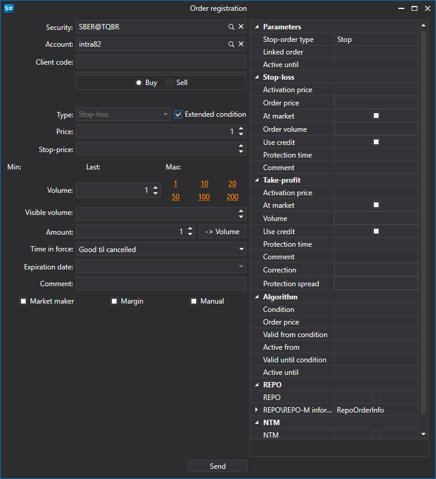

# New order creation

[OrderWindow](../api/StockSharp.Xaml.OrderWindow.html) \- window for creating an order. 



If the connection supports the registering a conditional order (stop\-loss, take\-profit), then in this window you can register a conditional order with advanced conditions by setting the **Advanced conditions** flag.

**Basic properties**

- [Portfolios](../api/StockSharp.Xaml.OrderWindow.Portfolios.html) \- list of portfolios.
- [MarketDataProvider](../api/StockSharp.Xaml.OrderWindow.MarketDataProvider.html) \- market data provider.
- [SecurityProvider](../api/StockSharp.Xaml.OrderWindow.SecurityProvider.html) \- security information provider.
- [Order](../api/StockSharp.Xaml.OrderWindow.Order.html) \- created order.

Code snippets using it are shown below. Sample code taken from *Samples\/Common\/SampleConnection*. 

```cs
...
private readonly Connector \_connector \= new Connector();
...
private void NewOrderClick(object sender, RoutedEventArgs e)
{
	var newOrder \= new OrderWindow
	{
		Order \= new Order { Security \= SecurityPicker.SelectedSecurity },
		SecurityProvider \= \_connector,
		MarketDataProvider \= \_connector,
		Portfolios \= new PortfolioDataSource(\_connector),
	};
	if (newOrder.ShowModal(this))
		\_connector.RegisterOrder(newOrder.Order);
}
              		
	  				
```
