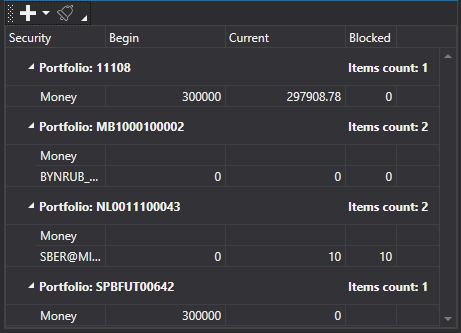

# Table

[PortfolioGrid](../api/StockSharp.Xaml.PortfolioGrid.html) is a component that displays the status of portfolios and positions. 



**Main properties**

- [Portfolios](../api/StockSharp.Xaml.PortfolioGrid.Portfolios.html) – the list of portfolios.
- [Positions](../api/StockSharp.Xaml.PortfolioGrid.Positions.html) – the list of positions.
- [SelectedPosition](../api/StockSharp.Xaml.PortfolioGrid.SelectedPosition.html) – the selected position.
- [SelectedPositions](../api/StockSharp.Xaml.PortfolioGrid.SelectedPositions.html) \- selected positions.

Below is the code snippet with its use. The code example is taken from *Samples\/InteractiveBrokers\/SampleIB.*

```xaml
<Window x:Class="Sample.PortfoliosWindow"
        xmlns="http://schemas.microsoft.com/winfx/2006/xaml/presentation"
        xmlns:x="http://schemas.microsoft.com/winfx/2006/xaml"
        xmlns:loc="clr-namespace:StockSharp.Localization;assembly=StockSharp.Localization"
        xmlns:xaml="http://schemas.stocksharp.com/xaml"
        Title="{x:Static loc:LocalizedStrings.Portfolios}" Height="200" Width="470">
	<xaml:PortfolioGrid x:Name="PortfolioGrid" x:FieldModifier="public" />
</Window>
	  				
```
```cs
				  
private readonly Connector _connector = new Connector();
private void ConnectClick(object sender, RoutedEventArgs e)
{
	.........................................................				
	_connector.NewPortfolio += portfolio => _portfoliosWindow.PortfolioGrid.Portfolios.Add(portfolio);
	_connector.NewPosition += position => _portfoliosWindow.PortfolioGrid.Positions.Add(position);
	.........................................................
}
	  				
```
