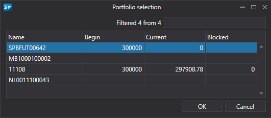

# Portfolio picker window

[PortfolioPickerWindow](../api/StockSharp.Xaml.PortfolioPickerWindow.html) is the window for selecting a portfolio. The window displays a list of portfolios and information about the cash positions of portfolios.



**Main properties**

- [Portfolios](../api/StockSharp.Xaml.PortfolioPickerWindow.Portfolios.html) \- the list of portfolios.
- [SelectedPortfolio](../api/StockSharp.Xaml.PortfolioPickerWindow.SelectedPortfolio.html) \- the selected portfolio.

Below is the code snippet with its use. 

```cs
private void Button_Click(object sender, RoutedEventArgs e)
{
	var wnd = new PortfolioPickerWindow();
	if (Portfolios != null)
		wnd.Portfolios = Portfolios;
	if (wnd.ShowModal(this))
	{
		SelectedPortfolio = wnd.SelectedPortfolio;
	}
}
	  				
```
