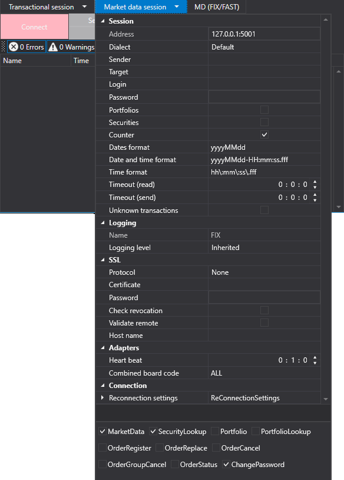

# Object properties editing table

[PropertyGridEx](../api/StockSharp.Xaml.PropertyGrid.PropertyGridEx.html) \- the table for editing object properties. The component includes a set of additional editors for system types and [S\#](StockSharpAbout.md) types. 



[PropertyGridEx](../api/StockSharp.Xaml.PropertyGrid.PropertyGridEx.html) has its own editors for the following types: 

- [StockSharp.Messages.Unit](../api/StockSharp.Messages.Unit.html). 
- [StockSharp.BusinessEntities.Security](../api/StockSharp.BusinessEntities.Security.html). 
- [StockSharp.BusinessEntities.Portfolio](../api/StockSharp.BusinessEntities.Portfolio.html). 
- [StockSharp.BusinessEntities.ExchangeBoard](../api/StockSharp.BusinessEntities.ExchangeBoard.html). 
- [StockSharp.BusinessEntities.Exchange](../api/StockSharp.BusinessEntities.Exchange.html). 
- [StockSharp.Algo.Candles.CandleSeries](../api/StockSharp.Algo.Candles.CandleSeries.html). 
- **ExtensionInfo** directory. 
- [System.TimeSpan](../api/System.TimeSpan.html), [System.DateTime](../api/System.DateTime.html) and [System.DateTimeOffset](../api/System.DateTimeOffset.html). 
- [System.Net.EndPoint](../api/System.Net.EndPoint.html) and [System.Net.IPAddress](../api/System.Net.IPAddress.html). 
- [System.Security.SecureString](../api/System.Security.SecureString.html). 
- [System.Text.Encoding](../api/System.Text.Encoding.html). 
- [System.Enum](../api/System.Enum.html). 

**Main properties**

- [SecurityProvider](../api/StockSharp.Xaml.PropertyGrid.PropertyGridEx.SecurityProvider.html) \- the provider of information about instruments. 
- [ExchangeInfoProvider](../api/StockSharp.Xaml.PropertyGrid.PropertyGridEx.ExchangeInfoProvider.html) \- the provider of site information. 
- [Portfolios](../api/StockSharp.Xaml.PropertyGrid.PropertyGridEx.Portfolios.html) \- the list of available portfolios. 
- **SelectedObject** \- the object whose properties will be displayed in the table. 

Below is the code snippet with its use. The code example is taken from *Samples\/Fix\/SampleFix*. 

```xaml
\<Window x:Class\="SampleFix.MainWindow"
		xmlns\="http:\/\/schemas.microsoft.com\/winfx\/2006\/xaml\/presentation"
		xmlns:x\="http:\/\/schemas.microsoft.com\/winfx\/2006\/xaml"
		xmlns:loc\="clr\-namespace:StockSharp.Localization;assembly\=StockSharp.Localization"
		xmlns:xctk\="http:\/\/schemas.xceed.com\/wpf\/xaml\/toolkit"
        xmlns:propertyGrid\="http:\/\/schemas.stocksharp.com\/xaml"
        Title\="{x:Static loc:LocalizedStrings.XamlStr540}" Height\="110" Width\="512"\>
	\<Grid\>
		\<Grid.ColumnDefinitions\>
			\<ColumnDefinition \/\>
			\<ColumnDefinition \/\>
			\<ColumnDefinition \/\>
			\<ColumnDefinition \/\>
			\<ColumnDefinition \/\>
		\<\/Grid.ColumnDefinitions\>
		\<Grid.RowDefinitions\>
			\<RowDefinition Height\="24" \/\>
			\<RowDefinition Height\="Auto" \/\>
			\<RowDefinition Height\="Auto" \/\>
		\<\/Grid.RowDefinitions\>
		\<StackPanel Grid.Column\="0" Grid.Row\="0" Grid.ColumnSpan\="5" Orientation\="Horizontal"\>
			\<xctk:DropDownButton Content\="{x:Static loc:LocalizedStrings.TransactionalSession}"\>
				\<xctk:DropDownButton.DropDownContent\>
					\<propertyGrid:PropertyGridEx x:Name\="TransactionSessionSettings" \/\>
				\<\/xctk:DropDownButton.DropDownContent\>
			\<\/xctk:DropDownButton\>
			\<xctk:DropDownButton Content\="{x:Static loc:LocalizedStrings.MarketDataSession}"\>
				\<xctk:DropDownButton.DropDownContent\>
					\<propertyGrid:PropertyGridEx x:Name\="MarketDataSessionSettings" \/\>
				\<\/xctk:DropDownButton.DropDownContent\>
			\<\/xctk:DropDownButton\>
		\<\/StackPanel\>
		
		\<Button x:Name\="ConnectBtn" Background\="LightPink" Grid.Column\="0" Grid.Row\="1" Grid.RowSpan\="2" Content\="{x:Static loc:LocalizedStrings.Connect}" Click\="ConnectClick" \/\>
		\<Button x:Name\="ShowSecurities" Grid.Column\="1" Grid.Row\="1" IsEnabled\="False" Content\="{x:Static loc:LocalizedStrings.Securities}" Click\="ShowSecuritiesClick" \/\>
		\<Button x:Name\="ShowPortfolios" Grid.Column\="2" Grid.Row\="1" IsEnabled\="False" Content\="{x:Static loc:LocalizedStrings.Portfolios}" Click\="ShowPortfoliosClick" \/\>
		\<Button x:Name\="ShowStopOrders" Grid.Column\="3" Grid.Row\="1" IsEnabled\="False" Content\="{x:Static loc:LocalizedStrings.StopOrders}" Click\="ShowStopOrdersClick" \/\>
		\<Button x:Name\="ShowNews" Grid.Column\="4" Grid.Row\="1" IsEnabled\="False" Content\="{x:Static loc:LocalizedStrings.News}" Click\="ShowNewsClick" \/\>
		
		\<Button x:Name\="ShowTrades" Grid.Column\="1" Grid.Row\="2" IsEnabled\="False" Content\="{x:Static loc:LocalizedStrings.Ticks}" Click\="ShowTradesClick" \/\>
		\<Button x:Name\="ShowMyTrades" Grid.Column\="2" Grid.Row\="2" IsEnabled\="False" Content\="{x:Static loc:LocalizedStrings.MyTrades}" Click\="ShowMyTradesClick" \/\>
		\<Button x:Name\="ShowOrders" Grid.Column\="3" Grid.Row\="2" IsEnabled\="False" Content\="{x:Static loc:LocalizedStrings.Orders}" Click\="ShowOrdersClick" \/\>
	\<\/Grid\>
\<\/Window\>
	  				
```
```cs
private readonly Connector \_connector \= new Connector();
public MainWindow()
{
	InitializeComponent();
	Title \= Title.Put("FIX");
	\_ordersWindow.MakeHideable();
	\_myTradesWindow.MakeHideable();
	\_tradesWindow.MakeHideable();
	\_securitiesWindow.MakeHideable();
	\_stopOrdersWindow.MakeHideable();
	\_portfoliosWindow.MakeHideable();
	\_newsWindow.MakeHideable();
	if (File.Exists(\_settingsFile))
	{
		\_connector\_connector.Load(new XmlSerializer\<SettingsStorage\>().Deserialize(\_settingsFile));
	}
	MarketDataSessionSettings.SelectedObject \= ((ChannelMessageAdapter)\_connector.MarketDataAdapter).InnerAdapter;
	TransactionSessionSettings.SelectedObject \= ((ChannelMessageAdapter)\_connector.TransactionAdapter).InnerAdapter;
	Instance \= this;
	\_connector.LogLevel \= LogLevels.Debug;
	\_logManager.Sources.Add(\_connector);
	\_logManager.Listeners.Add(new FileLogListener { LogDirectory \= "StockSharp\_Fix" });
}
	  				
```
