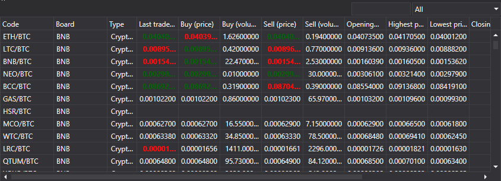

# Picker

The [SecurityPicker](../api/StockSharp.Xaml.SecurityPicker.html) component is designed to find and select instruments. It supports both single and multiple choice. The component allows you to filter the list of instruments by their type. This component can also be used to display financial information (level1 fields), as shown in the [SecurityGrid](GuiSecurityGrid.md) section. 



[SecurityPicker](../api/StockSharp.Xaml.SecurityPicker.html) consists of: 

1. A text field, to enter the code (or Id) of the instrument. When you enter, the list is filtered by the entered substring.
2. The special [SecurityTypeComboBox](../api/StockSharp.Xaml.SecurityTypeComboBox.html) combo box for filtering instruments by their type.
3. The [SecurityGrid](../api/StockSharp.Xaml.SecurityGrid.html) table to display the list of instruments.

**Main properties**

- [SelectionMode](../api/StockSharp.Xaml.SecurityPicker.SelectionMode.html) \- instrument selection mode: single, multiple.
- [ShowCommonStatColumns](../api/StockSharp.Xaml.SecurityPicker.ShowCommonStatColumns.html) \- to display the main columns.
- [ShowCommonOptionColumns](../api/StockSharp.Xaml.SecurityPicker.ShowCommonOptionColumns.html) \- to display the main columns for options.
- [Title](../api/StockSharp.Xaml.SecurityPicker.Title.html) \- the title that is displayed at the top of the component.
- [Securities](../api/StockSharp.Xaml.SecurityPicker.Securities.html) \- the list of instruments.
- [SelectedSecurity](../api/StockSharp.Xaml.SecurityPicker.SelectedSecurity.html) \- the selected instrument.
- [SelectedSecurities](../api/StockSharp.Xaml.SecurityPicker.SelectedSecurities.html) \- the list of selected instruments.
- [FilteredSecurities](../api/StockSharp.Xaml.SecurityPicker.FilteredSecurities.html) \- the list of filtered instruments.
- [ExcludeSecurities](../api/StockSharp.Xaml.SecurityPicker.ExcludeSecurities.html) \- the list of hidden instruments.
- [SelectedType](../api/StockSharp.Xaml.SecurityPicker.SelectedType.html) \- the selected instrument type.
- [SecurityProvider](../api/StockSharp.Xaml.SecurityPicker.SecurityProvider.html) \- the provider of information about instruments.
- [MarketDataProvider](../api/StockSharp.Xaml.SecurityPicker.MarketDataProvider.html) \- the provider of market data.

Below is the code snippet with its use, taken from example *Samples\/InteractiveBrokers\/SampleIB*. 

```xaml
\<Window x:Class\="Sample.SecuritiesWindow"
    xmlns\="http:\/\/schemas.microsoft.com\/winfx\/2006\/xaml\/presentation"
    xmlns:x\="http:\/\/schemas.microsoft.com\/winfx\/2006\/xaml"
    xmlns:loc\="clr\-namespace:StockSharp.Localization;assembly\=StockSharp.Localization"
    xmlns:xaml\="http:\/\/schemas.stocksharp.com\/xaml"
    Title\="{x:Static loc:LocalizedStrings.Securities}" Height\="415" Width\="1081"\>
	\<Grid\>
		\<Grid.RowDefinitions\>
			\<RowDefinition Height\="\*" \/\>
			\<RowDefinition Height\="Auto" \/\>
		\<\/Grid.RowDefinitions\>
		\<xaml:SecurityPicker x:Name\="SecurityPicker" x:FieldModifier\="public" SecuritySelected\="SecurityPicker\_OnSecuritySelected" ShowCommonStatColumns\="True" \/\>
	\<\/Grid\>
\<\/Window\>
	  	
```
```cs
private void ConnectClick(object sender, RoutedEventArgs e)
{
    ......................................
	\_connector.NewSecurity +\= security \=\> \_securitiesWindow.SecurityPicker.Securities.Add(security);
	\_securitiesWindow.SecurityPicker.MarketDataProvider \= \_connector;
	......................................
}
private void SecurityPicker\_OnSecuritySelected(Security security)
{
	NewStopOrder.IsEnabled \= NewOrder.IsEnabled \=
	Level1.IsEnabled \= Depth.IsEnabled \= security \!\= null;
}
```
