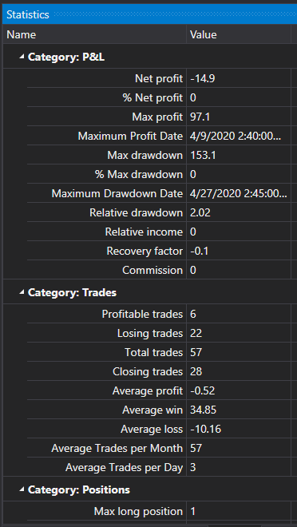

# Statistics

[StrategiesStatisticsPanel](xref:StockSharp.Xaml.StrategiesStatisticsPanel) \- is the table to display parameters and statistics of the strategies. 



**Main properties and methods**

- [ExcludeParameters](xref:StockSharp.Xaml.StrategiesStatisticsPanel.ExcludeParameters) \- the list of parameters hidden from the visualization.
- [SelectedStrategy](xref:StockSharp.Xaml.StrategiesStatisticsPanel.SelectedStrategy) \- the selected strategy.
- [SelectedStrategies](xref:StockSharp.Xaml.StrategiesStatisticsPanel.SelectedStrategies) \- selected strategies.
- [AddStrategies](xref:StockSharp.Xaml.StrategiesStatisticsPanel.AddStrategies) \- adds strategies to the table.
- [SetColumnVisibility](xref:StockSharp.Xaml.StrategiesStatisticsPanel.SetColumnVisibility) \- sets the visibility of the columns in the table.

Below is the code snippet with its use. The code example is taken from *Samples\/Testing\/SampleHistoryTestingParallel*. 

```xaml
<Window x:Class="SampleHistoryTestingParallel.MainWindow"
        xmlns="http://schemas.microsoft.com/winfx/2006/xaml/presentation"
        xmlns:x="http://schemas.microsoft.com/winfx/2006/xaml"
        xmlns:loc="clr-namespace:StockSharp.Localization;assembly=StockSharp.Localization"
        xmlns:charting="http://schemas.stocksharp.com/xaml"
        Title="{x:Static loc:LocalizedStrings.XamlStr563}" Height="430" Width="525">
    
	<Grid>
		<Grid.ColumnDefinitions>
			<ColumnDefinition Width="100" />
			<ColumnDefinition Width="*" />
			<ColumnDefinition Width="Auto" />
		</Grid.ColumnDefinitions>
		<Grid.RowDefinitions>
			<RowDefinition Height="Auto" />
			<RowDefinition Height="10" />
			<RowDefinition Height="Auto" />
			<RowDefinition Height="10" />
			<RowDefinition Height="*" />
		</Grid.RowDefinitions>
		<Label Grid.Column="0" Grid.Row="0" Content="{x:Static loc:LocalizedStrings.XamlStr593}" />
		<TextBox x:Name="HistoryPath" Text="" Grid.Column="1" Grid.Row="0" />
		<Button x:Name="FindPath" Grid.Column="2" Grid.Row="0" Content="..." Width="25" HorizontalAlignment="Left" Click="FindPathClick" />
		<Button x:Name="StartBtn" Content="{x:Static loc:LocalizedStrings.Str2421}" Grid.Row="2" Grid.Column="0" Click="StartBtnClick" />
		<ProgressBar x:Name="TestingProcess" Grid.Column="1" Grid.Row="2" />
        <TabControl Grid.Row="4" Grid.ColumnSpan="3" Grid.Column="0" >
            <TabItem Header="{x:Static loc:LocalizedStrings.Equity}">
                <charting:EquityCurveChart x:Name="Curve" />
            </TabItem>
            <TabItem Header="{x:Static loc:LocalizedStrings.Str436}">
                <charting:StrategiesStatisticsPanel x:Name="Stat" ShowProgress="False"/>
            </TabItem>
        </TabControl>
	</Grid>
</Window>
	  				
```
```cs
var strategies = periods
	.Select(period =>
		{
			...
			// create strategy based SMA
			var strategy = new SmaStrategy(series, new SimpleMovingAverage { Length = period.Item1 }, new SimpleMovingAverage { Length = period.Item2 })
			{
				Volume = 1,
				Security = security,
				Portfolio = portfolio,
				Connector = connector,
				// by default interval is 1 min,
				// it is excessively for time range with several months
				UnrealizedPnLInterval = ((stopTime - startTime).Ticks / 1000).To<TimeSpan>()
			};
			...
			var curveItems = Curve.CreateCurve(LocalizedStrings.Str3026Params.Put(period.Item1, period.Item2), period.Item3, ChartIndicatorDrawStyles.Line);
			strategy.PnLChanged += () =>
			{
				var data = new EquityData
				{
					Time = strategy.CurrentTime,
					Value = strategy.PnL,
				};
				this.GuiAsync(() => curveItems.Add(data));
			};
			Stat.AddStrategies(new[] { strategy });
			return strategy;
		})
		.ToEx(periods.Length);
              		
	  				
```
