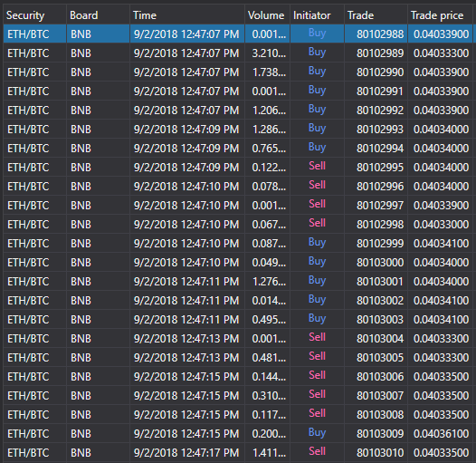

# Ticks



[TradeGrid](xref:StockSharp.Xaml.TradeGrid) \- trade table. 

**Main properties**

- [TradeGrid.Trades](xref:StockSharp.Xaml.TradeGrid.Trades) \- the list of trades.
- [TradeGrid.SelectedTrade](xref:StockSharp.Xaml.TradeGrid.SelectedTrade) \- the selected trade.
- [TradeGrid.SelectedTrades](xref:StockSharp.Xaml.TradeGrid.SelectedTrades) \- selected trades.

Below is the code snippet with its use. The code example is taken from *Samples\/InteractiveBrokers\/SampleIB*. 

```xaml
<Window x:Class="Sample.TradesWindow"
    xmlns="http://schemas.microsoft.com/winfx/2006/xaml/presentation"
    xmlns:x="http://schemas.microsoft.com/winfx/2006/xaml"
    xmlns:loc="clr-namespace:StockSharp.Localization;assembly=StockSharp.Localization"
    xmlns:xaml="http://schemas.stocksharp.com/xaml"
    Title="{x:Static loc:LocalizedStrings.Str985}" Height="284" Width="544">
	<xaml:TradeGrid x:Name="TradeGrid" x:FieldModifier="public" />
</Window>
	  				
```
```cs
private void ConnectClick(object sender, RoutedEventArgs e)
{
	.......................................
	_connector.NewMyTrade += trade => _myTradesWindow.TradeGrid.Trades.Add(trade);
	
	_connector.NewTrade += trade => _tradesWindow.TradeGrid.Trades.Add(trade);
	.......................................
}            		
	  				
```
