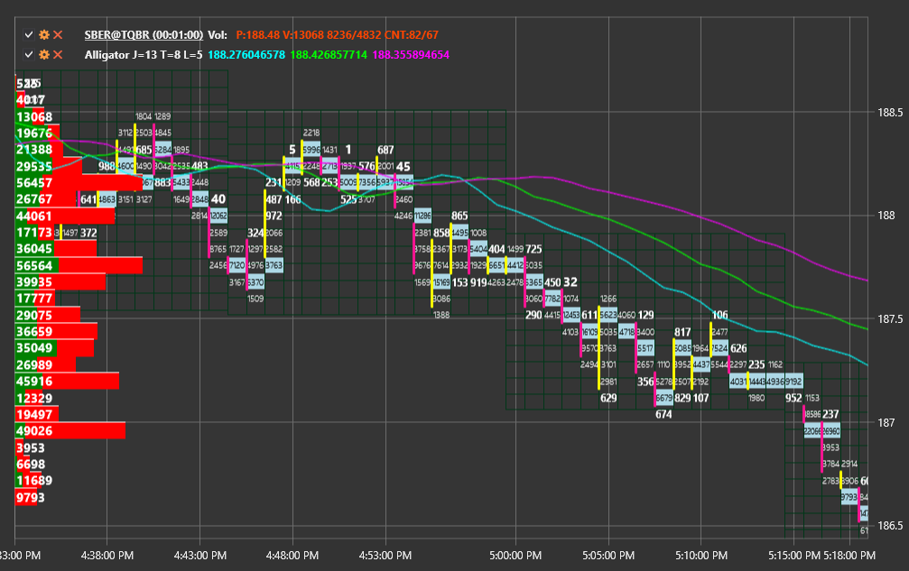

# Box chart

BoxChart \- is the special type of chart for displaying the volumes in the form of a numbers grid. To use this chart type, it is necessary to set the special style [ChartCandleElement.DrawStyle](xref:StockSharp.Xaml.Charting.ChartCandleElement.DrawStyle) \= [ChartCandleDrawStyles.BoxVolume](xref:StockSharp.Xaml.Charting.ChartCandleDrawStyles.BoxVolume) This chart uses the information from the [Candle.PriceLevels](xref:StockSharp.Algo.Candles.Candle.PriceLevels) property as source data. 

**Main properties**

- [Timeframe2Multiplier](xref:StockSharp.Xaml.Charting.ChartCandleElement.Timeframe2Multiplier) \- the multiplier factor that is applied to the main timeframe specified in the constructor to get a second timeframe. The displayed candles are joined together in groups of size corresponding to the second timeframe. The groups are drawn on the chart by the grid and frame of the respective colors. 
- [Timeframe3Multiplier](xref:StockSharp.Xaml.Charting.ChartCandleElement.Timeframe3Multiplier) \- is similarly to [Timeframe2Multiplier](xref:StockSharp.Xaml.Charting.ChartCandleElement.Timeframe2Multiplier), but for the third timeframe. The 3rd timeframe is drawn on the chart using the grid of the corresponding color. 
- [FontColor](xref:StockSharp.Xaml.Charting.ChartCandleElement.FontColor) \- the volumes values color on the chart. 
- [MaxVolumeColor](xref:StockSharp.Xaml.Charting.ChartCandleElement.MaxVolumeColor) \- the volumes values color on the chart for the maximum volume in the specified candle. 
- [Timeframe2Color](xref:StockSharp.Xaml.Charting.ChartCandleElement.Timeframe2Color) \- the 2nd timeframe grid color. 
- [Timeframe2FrameColor](xref:StockSharp.Xaml.Charting.ChartCandleElement.Timeframe2FrameColor) \- the 2nd timeframe frame color. 
- [Timeframe3Color](xref:StockSharp.Xaml.Charting.ChartCandleElement.Timeframe3Color) \- the 3rd timeframe grid color. 

An example of using this type of chart is in *Samples\/Common\/SampleChart*. 

> [!TIP]
> To switch between the chart types, use the settings button (gear), located in the upper left corner of the chart.
