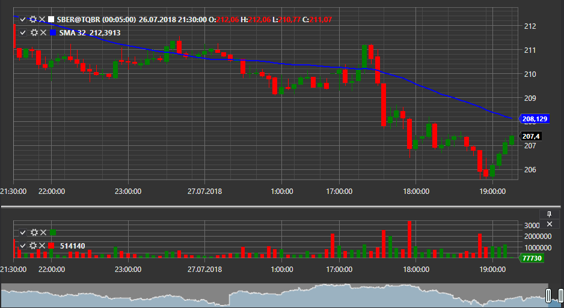

# Candle chart

[Chart](../api/StockSharp.Xaml.Charting.Chart.html) \- the graphical component that allows to plot the stock charts: candles, indicators, and to display on the charts the markers of orders and trades. 

Below is an example of the chart plotting using the [Chart](../api/StockSharp.Xaml.Charting.Chart.html). The example from Samples\/Chart\/SampleChart is taken as a basis, in which some changes were made. 



### Example of chart plotting using Chart

Example of chart plotting using Chart

1. In XAML creating window and adding to it the graphical component [StockSharp.Xaml.Charting.Chart](../api/StockSharp.Xaml.Charting.Chart.html). Assigning the **Chart** name to the component. Note that when the window is being created it is necessary to add the *http:\/\/schemas.stocksharp.com\/xaml* namespace. 

   ```xaml
   <Window x:Class="SampleChart.MainWindow"
           xmlns="http://schemas.microsoft.com/winfx/2006/xaml/presentation"
           xmlns:x="http://schemas.microsoft.com/winfx/2006/xaml"
           xmlns:charting="http://schemas.stocksharp.com/xaml"
           Title="ChartWindow" Height="300" Width="300">
      <charting:ChartPanel x:Name="Chart" IsInteracted="True" Grid.Row="1"/>
   </Window>
   	  				
   ```
2. 2. In the main window code we declare the variables for the chart areas, the chart elements and indicators. 

   ```cs
                 		
   private readonly Dictionary<CandleSeries, ChartWindow> _chartWindows = new Dictionary<CandleSeries, ChartWindow>();
   private readonly Connector _connector = new Connector();
   private readonly LogManager _logManager;
   private ChartArea _candlesArea;
   private ChartArea _indicatorsArea;
   private ChartIndicatorElement _smaChartElement;
   private ChartIndicatorElement _macdChartElement;
   private ChartCandleElement _candlesElem;
   private SimpleMovingAverage _sma;
   private MovingAverageConvergenceDivergence _macd;
                 		
   	  				
   ```
3. 3. In the **Click** event handler of the **Connect** button, along with subscribing to connector events and calling the [Connect](../api/StockSharp.BusinessEntities.IConnector.Connect.html) method, we subscribe to the [Connector.CandleSeriesProcessing](../api/StockSharp.Algo.Connector.CandleSeriesProcessing.html) event. of this event, The chart plotting will be performed in the handler of this event when a new candle is received. 

   ```cs
                 		
   private void ConnectClick(object sender, RoutedEventArgs e)
   {
   		..........................................		 
   		_connector.CandleSeriesProcessing += DrawCandle;
   {
   		..........................................		 
   }
   	  				
   ```
4. In the **ShowChart** button handler we create the objects of indicators, areas and elements of the chart. Adding elements to the areas, and the areas to the chart. Opening the chart window and start the candle manager. 

   ```cs
   private void ShowChartClick(object sender, RoutedEventArgs e)
   {
   	var security = SelectedSecurity;
   	var series = new CandleSeries(CandlesSettings.Settings.CandleType, security, CandlesSettings.Settings.Arg);
   	_chartWindows.SafeAdd(series, key =>
   	{
   		var wnd = new ChartWindow
   		{
   			Title = "{0} {1} {2}".Put(security.Code, series.CandleType.Name, series.Arg)
   		};
   		wnd.MakeHideable();
           _sma = new SimpleMovingAverage() { Length = 11 };
           _macd = new MovingAverageConvergenceDivergence();
           _smaChartElement = new ChartIndicatorElement();
           _macdChartElement = new ChartIndicatorElement();
           _candlesElem = new ChartCandleElement();
           _macdChartElement.DrawStyle = ChartIndicatorDrawStyles.Histogram;
           _candlesArea = new ChartArea();
           _indicatorsArea = new ChartArea();
           wnd.Chart.Areas.Add(_candlesArea);
           wnd.Chart.Areas.Add(_indicatorsArea);
           _candlesArea.Elements.Add(_candlesElem);
           _candlesArea.Elements.Add(_smaChartElement);
           _indicatorsArea.Elements.Add(_macdChartElement);
           return wnd;
   	}).Show();
   	_connector.SubscribeCandles(series, DateTime.Today.Subtract(TimeSpan.FromDays(30)), DateTime.Now);
   }
   	  				
   ```
5. 5. In the [Connector.CandleSeriesProcessing](../api/StockSharp.Algo.Connector.CandleSeriesProcessing.html) event handler we draw the candle and the values of the indicators for each completed candle. For this, we: 
   1. Calculate the values of the indicators.
   2. Fill the **elements** directory with pairs "element object \- element value".
   3. To draw a chart, we call the [Chart.Draw](../api/StockSharp.Xaml.Charting.Chart.Draw.html), method, to which we pass the time and the dictionary of elements.

   The result of the program is shown in the figure above. 

   ```cs
   private void DrawCandle(CandleSeries series, Candle candle)
   {
   	var wnd = _chartWindows.TryGetValue(series);
   	if (wnd != null)
   	{
   		if (candle.State != CandleStates.Finished)
   			return;
   		var smaValue = _sma.Process(candle);
   		var macdValue = _macd.Process(candle);
   		var data = new ChartDrawData();
   		data
   		  .Group(candle.OpenTime)
   		    .Add(_candlesElem, candle)
   		    .Add(_smaChartElement, smaValue)
   		    .Add(_macdChartElement, macdValue);
           	wnd.Chart.Draw(data);
                  
   	}
   }
   ```
