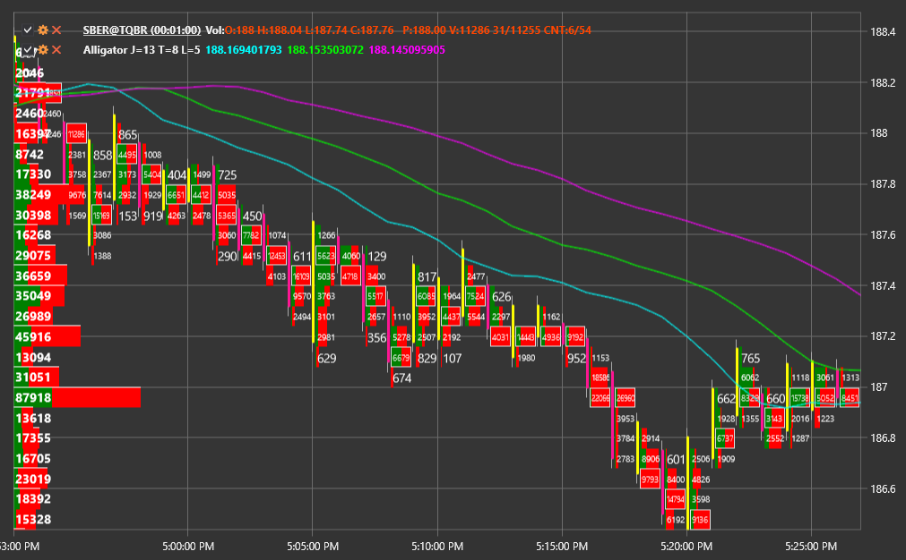

# Cluster chart

ClusterChart \- is the special type of chart to display the volumes in the form of clusters with the bar charts. To use this type of the chart it is necessary to set the special style [ChartCandleElement.DrawStyle](xref:StockSharp.Xaml.Charting.ChartCandleElement.DrawStyle) \= [ChartCandleDrawStyles.ClusterProfile](xref:StockSharp.Xaml.Charting.ChartCandleDrawStyles.ClusterProfile). This chart uses the information from the [Candle.PriceLevels](xref:StockSharp.Algo.Candles.Candle.PriceLevels) property as source data. 

**Main properties**

- [ClusterLineColor](xref:StockSharp.Xaml.Charting.ChartCandleElement.ClusterLineColor) \- the basic cluster line color. 
- [ClusterTextColor](xref:StockSharp.Xaml.Charting.ChartCandleElement.ClusterTextColor) \- the volumes values color on the chart. 
- [ClusterColor](xref:StockSharp.Xaml.Charting.ChartCandleElement.ClusterColor) \- the main bars color in the clusters histograms. 
- [ClusterMaxColor](xref:StockSharp.Xaml.Charting.ChartCandleElement.ClusterMaxColor) \- the maximum volume bar color in the clusters histograms. 

An example of using this type of chart is in *Samples\/Common\/SampleChart*. 

> [!TIP]
> To switch between the chart types, use the settings button (gear), located in the upper left corner of the chart.
