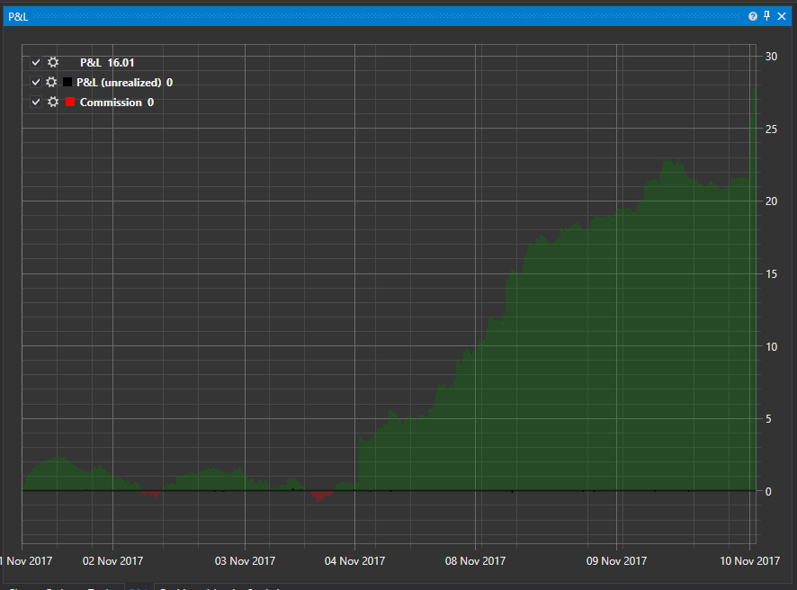

# Equity curve chart

[EquityCurveChart](../api/StockSharp.Xaml.Charting.EquityCurveChart.html) \- the graphical component for displaying the equity curve. 

Below is an example of using this component. The full example code is in the Samples\/Testing\/SampleRandomEmulation. 



### Example of the EquityCurveChart plotting

Example of the EquityCurveChart plotting

1. We add the [EquityCurveChart](../api/StockSharp.Xaml.Charting.EquityCurveChart.html) graphical component to XAML. Assigning the **Curve** name to the component. 

   ```xaml
   \<Window x:Class\="SampleRandomEmulation.MainWindow"
           xmlns\="http:\/\/schemas.microsoft.com\/winfx\/2006\/xaml\/presentation"
           xmlns:x\="http:\/\/schemas.microsoft.com\/winfx\/2006\/xaml"
           xmlns:loc\="clr\-namespace:StockSharp.Localization;assembly\=StockSharp.Localization"
           Title\="{x:Static loc:LocalizedStrings.XamlStr564}" Height\="460" Width\="604"
   		xmlns:sx\="clr\-namespace:StockSharp.Xaml;assembly\=StockSharp.Xaml"
   		xmlns:charting\="http:\/\/schemas.stocksharp.com\/xaml"\>
       
   	\<Grid\>
   		\<Grid.ColumnDefinitions\>
   			\<ColumnDefinition Width\="85\*" \/\>
   			\<ColumnDefinition Width\="497\*" \/\>
   		\<\/Grid.ColumnDefinitions\>
   		\<Grid.RowDefinitions\>
   			\<RowDefinition Height\="Auto"\/\>
   			\<RowDefinition Height\="\*"\/\>
   		\<\/Grid.RowDefinitions\>
   		\<Grid Grid.ColumnSpan\="2"\>
   			\<Grid.ColumnDefinitions\>
   				\<ColumnDefinition Width\="100" \/\>
   				\<ColumnDefinition Width\="\*" \/\>
   				\<ColumnDefinition Width\="Auto" \/\>
   			\<\/Grid.ColumnDefinitions\>
   			\<Grid.RowDefinitions\>
   				\<RowDefinition Height\="Auto" \/\>
   				\<RowDefinition Height\="10" \/\>
   				\<RowDefinition Height\="Auto" \/\>
   				\<RowDefinition Height\="10" \/\>
   			\<\/Grid.RowDefinitions\>
   			\<Button x:Name\="StartBtn" Content\="{x:Static loc:LocalizedStrings.Str2421}" Grid.Row\="0" Click\="StartBtnClick" \/\>
   			\<ProgressBar x:Name\="TestingProcess" Grid.Column\="1" Grid.Row\="0" \/\>
   			\<Button x:Name\="Report" Content\="{x:Static loc:LocalizedStrings.XamlStr432}" Grid.Row\="0" Width\="75" IsEnabled\="False" Click\="ReportClick" Grid.Column\="2" Margin\="0,0,0,\-1" \/\>
   		\<\/Grid\>
   		
   		\<Grid Grid.Row\="1" Grid.ColumnSpan\="2" Grid.Column\="0"\>
   			\<Grid\>
   				\<Grid.ColumnDefinitions\>
   					\<ColumnDefinition Width\="180"\/\>
   					\<ColumnDefinition Width\="\*"\/\>
   				\<\/Grid.ColumnDefinitions\>
   				\<sx:StatisticParameterGrid Grid.Column\="0" x:Name\="ParameterGrid" \/\>
   				\<charting:EquityCurveChart Grid.Column\="1" x:Name\="Curve" \/\>
   			\<\/Grid\>
   		\<\/Grid\>
   	\<\/Grid\>
   \<\/Window\>
   	  				
   ```
2. In the main window code we create a data source to draw the chart using the [CreateCurve](../api/Overload:StockSharp.Xaml.Charting.EquityCurveChart.CreateCurve.html) method. 

   ```cs
   private readonly ICollection\<EquityData\> \_curveItems;
   .................................................
                 		
   public MainWindow()
   {
   	InitializeComponent();
   	\_logManager.Listeners.Add(new FileLogListener("log.txt"));
   	\_curveItems \= Curve.CreateCurve("Equity", Colors.DarkGreen, ChartIndicatorDrawStyles.Line);
   }
   	  				
   ```
3. When the PnL value of the strategy is changed we add data to the data source. In this case we use the special [EquityData](../api/StockSharp.Xaml.Charting.EquityData.html) class. 

   ```cs
   \_strategy.PnLChanged +\= () \=\>
   		{
   			var data \= new EquityData
   			{
   				Time \= \_strategy.CurrentTime,
   				Value \= \_strategy.PnL,
   			};
   			
   			this.GuiAsync(() \=\> \_curveItems.Add(data));
   		};
   	  				
   ```
