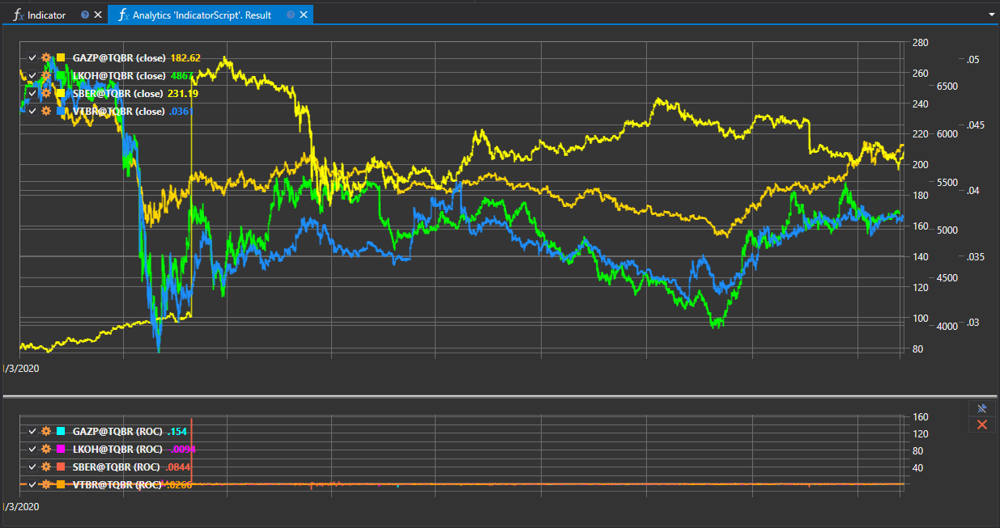

# Indicators

The "Indicator" script is intended to demonstrate working with technical analysis indicators within the StockSharp platform. It enables users to load historical data, apply various indicators to it, and display the results on a chart. This approach aids in market trend analysis and making informed trading decisions.



## Functional Capabilities

The script provides the following functionality:

- **Loading historical data**: Selecting financial instruments of interest and loading their historical data for a specified period.
- **Applying indicators**: Applying one or more technical analysis indicators to the loaded data.
- **Visualization**: Displaying data and analysis results using indicators on a chart, providing a clear view of market dynamics.

## Examples of Indicators

The script can work with a wide range of indicators, including but not limited to:

- **Moving Averages (MA)**: Represent the average price over a certain period, helping to identify trends.
- **Relative Strength Index (RSI)**: Assesses the magnitude and speed of price changes, helping to identify overbought or oversold conditions.
- **Bollinger Bands (BB)**: Show the range and volatility of prices, based on moving averages and standard deviations.

## Application in Trading and Analysis

Using technical analysis indicators through this script allows for:

- **Identifying trends**: Detecting the market's direction of movement to plan entry and exit strategies.
- **Identifying reversal points**: Determining moments when the market trend may change its direction.
- **Analyzing volatility**: Assessing the level of price instability to adapt strategies to market conditions.

## Implementation in the Script

To work with the script, the following steps need to be taken:

1. **Selecting an instrument and period**: Determining securities and the time frame for analysis.
2. **Applying indicators**: Choosing and setting parameters for the indicators to be applied to the data.
3. **Displaying results**: Visualizing historical data and indicators on a chart for analysis.

The "Indicator" script provides a powerful tool for in-depth analysis of financial markets, allowing traders and analysts to use these indicators to develop effective trading strategies.

## Script Code

```cs
namespace StockSharp.Algo.Analytics
{
	/// <summary>
	/// The analytic script, using indicator ROC.
	/// </summary>
	public class IndicatorScript : IAnalyticsScript
	{
		Task IAnalyticsScript.Run(ILogReceiver logs, IAnalyticsPanel panel, SecurityId[] securities, DateTime from, DateTime to, IStorageRegistry storage, IMarketDataDrive drive, StorageFormats format, TimeSpan timeFrame, CancellationToken cancellationToken)
		{
			if (securities.Length == 0)
			{
				logs.AddWarningLog("No instruments.");
				return Task.CompletedTask;
			}

			// creating 2 panes for candles and indicator series
			var candleChart = panel.CreateChart<DateTimeOffset, decimal>();
			var indicatorChart = panel.CreateChart<DateTimeOffset, decimal>();

			foreach (var security in securities)
			{
				// stop calculation if user cancel script execution
				if (cancellationToken.IsCancellationRequested)
					break;

				var candlesSeries = new Dictionary<DateTimeOffset, decimal>();
				var indicatorSeries = new Dictionary<DateTimeOffset, decimal>();

				// creating ROC
				var roc = new RateOfChange();

				// get candle storage
				var candleStorage = storage.GetTimeFrameCandleMessageStorage(security, timeFrame, drive, format);

				foreach (var candle in candleStorage.Load(from, to))
				{
					// fill series
					candlesSeries[candle.OpenTime] = candle.ClosePrice;
					indicatorSeries[candle.OpenTime] = roc.Process(candle).GetValue<decimal>();
				}

				// draw series on chart
				candleChart.Append($"{security} (close)", candlesSeries.Keys, candlesSeries.Values);
				indicatorChart.Append($"{security} (ROC)", indicatorSeries.Keys, indicatorSeries.Values);
			}

			return Task.CompletedTask;
		}
	}
}
```