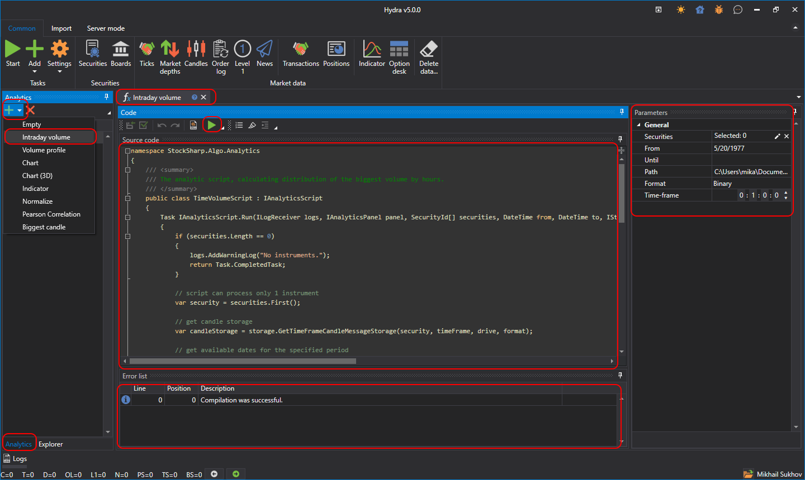
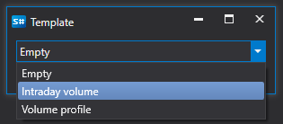
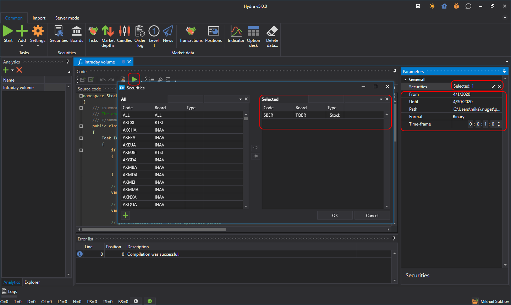

# Working with scripts

- After clicking on the **Analytics** button.

  
- A window will appear with a selection of a ready\-made template for editing it in the [S\#.Data](Hydra.md) editor. Then you need to click **OK**.

  
- After that, the script of the selected template will be loaded.

  IMPORTANT\! The script used must be a class inherited from the *BaseAnalyticsStrategy* class.

  
- To [start](HydraAnalyticsShow.md) the analytics, you should click the **Start** button. 
- To connect the required libraries, use the **Links** button.

> [!TIP]
> The standard S\#.Data distribution package includes two ready\-made scripts: **Volume within a day** and **Volume profil**
