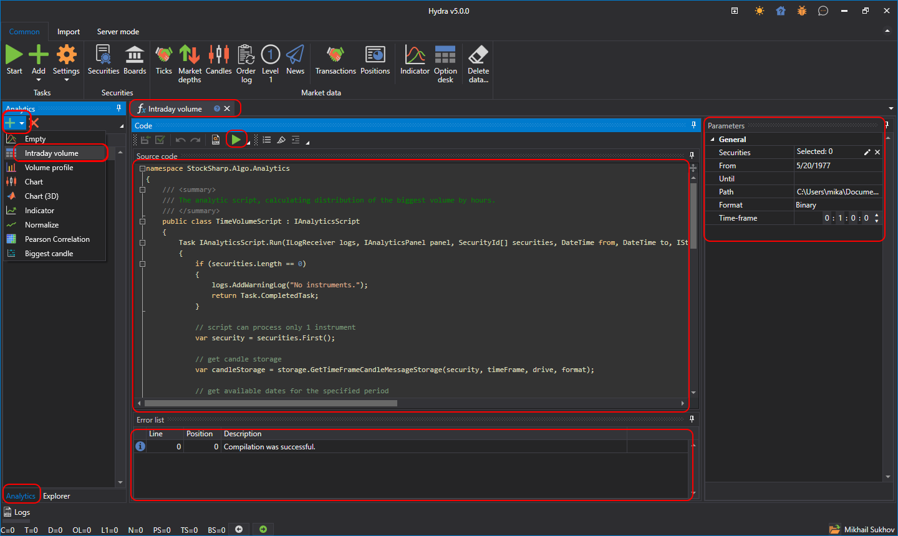

# Running a Script

To create a new analytics script, select the **Analytics** tab in the data sources panel on the main window, and choose the desired template from the drop-down menu for a quick start:

The screenshot presents the main interface of this feature, consisting of several key components:

- **Navigation Tree**: Provides quick access to various analytics functions and created analytics scripts, such as intraday volume analysis, volume profile, charts, indicators, and other analysis tools.
- **Code Window**: The code window displays the source code of the selected analytical script. Users can directly edit the code to customize or create analytical calculations and strategies.
- **Parameter Panel**: On the right side, there is a parameter panel where you can set parameters for analytical scripts, including the selection of instruments, analysis period, data path, and other settings.
- **Error List**: At the bottom of the interface, there is a list of errors detected during the compilation or execution of the analytical script.

The analytics script is formatted as a class inherited from [IAnalyticsScript](xref:StockSharp.Algo.Analytics.IAnalyticsScript).

When setting parameters:

- **Instrument** can be set from 1 to several instruments depending on the script's logic.

- Date range.
- The storage from which to fetch data.
- The working timeframe of the script if it uses one.

Clicking the **Start** button  will open a new tab displaying the results of the script's execution.