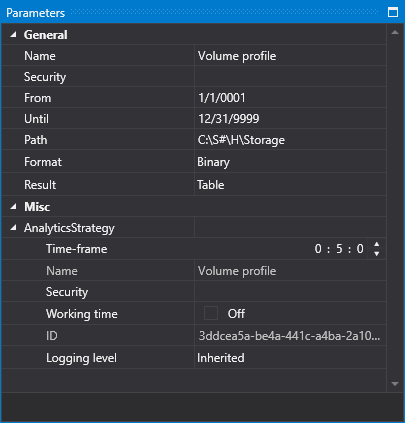
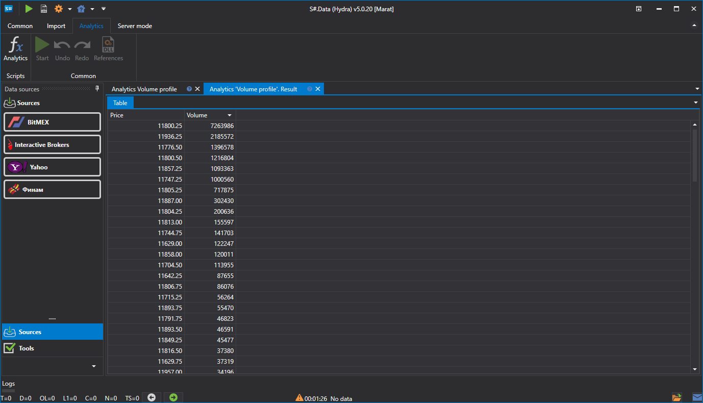

# Running and displaying results

Below is a sequence of steps to perform data analysis.

### Running the script and displaying the analysis results using the SBER@TQBR security as an example:

For example, we [select the template](HydraAnalyticsScripts.md)**Volume within a day**.

1. Select data for analysis:
   - In the **Parameters** window on the right side of program
   - Specify the instrument, in our case SBER@TQBR. Start and end date, data path and format.
2. Run the script using the  button.
3. Then the processing result will be displayed.. 
4. View results:

   By default, the result is generated as a table. To view the received data in the form of charts, you should select one of several options for data output.

   After that, the selected chart will be plotted based on the analytics process results.
