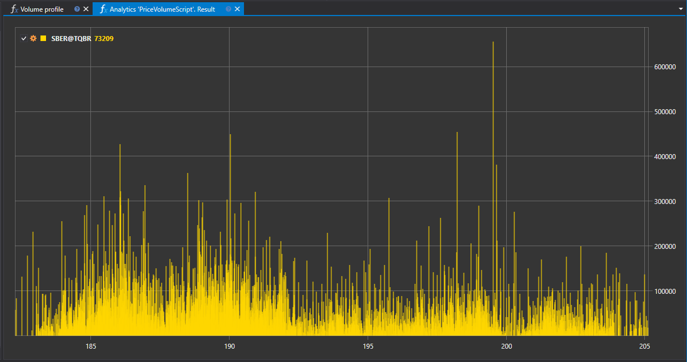

# Volume Profile

The "Volume Profile" script serves as a tool for analyzing the distribution of trading volume across price levels over a selected period. It enables traders and quantitative analysts to visualize and examine where the main trading activity was concentrated in terms of price levels.



## Functionality Description

The script aggregates transaction data to form a profile that displays the volumes executed at various price levels. This information can be represented on a chart, illustrating the density of trades across different price points.

## Practical Significance

Analyzing the volume profile helps in identifying key demand and supply zones and can be used for:

- Identifying support and resistance levels where the instrument finds significant interest from market participants.
- Assessing the strength of the current trend or its potential weakening, based on the change in volume distribution.
- Planning entry and exit points from the market, considering levels with maximum accumulated liquidity.

## Application in Trading and Quantitative Analysis

- **Trading**: The volume profile can be utilized to develop strategies based on volume analysis, providing a clear view of where the main trading operations occur.
- **Quantitative Analysis**: Data on volume distribution can serve as input for quantitative models predicting the likelihood of price movements based on the volume accumulated at a level.

## Script Implementation

The "Volume Profile" script performs the following steps:

1. **Data Collection**: The script aggregates transaction data for the specified period.
2. **Profile Formation**: Based on the collected data, the script forms a volume profile reflecting trading activity at each price level.
3. **Visualization**: The results of the script's operation are visualized as a chart or histogram, where each bar corresponds to a specific price level and its trading volume.

Utilizing the "Volume Profile" script within the StockSharp platform allows for comprehensive market analysis, building well-founded trading hypotheses, and improving the quality of trading decisions made.

## Script Code

```cs
namespace StockSharp.Algo.Analytics
{
	/// <summary>
	/// The analytic script, calculating distribution of the volume by price levels.
	/// </summary>
	public class PriceVolumeScript : IAnalyticsScript
	{
		Task IAnalyticsScript.Run(ILogReceiver logs, IAnalyticsPanel panel, SecurityId[] securities, DateTime from, DateTime to, IStorageRegistry storage, IMarketDataDrive drive, StorageFormats format, TimeSpan timeFrame, CancellationToken cancellationToken)
		{
			if (securities.Length == 0)
			{
				logs.AddWarningLog("No instruments.");
				return Task.CompletedTask;
			}

			// script can process only 1 instrument
			var security = securities.First();

			// get candle storage
			var candleStorage = storage.GetTimeFrameCandleMessageStorage(security, timeFrame, drive, format);

			// get available dates for the specified period
			var dates = candleStorage.GetDates(from, to).ToArray();

			if (dates.Length == 0)
			{
				logs.AddWarningLog("no data");
				return Task.CompletedTask;
			}

			// grouping candles by middle price
			var rows = candleStorage.Load(from, to)
				.GroupBy(c => c.LowPrice + c.GetLength() / 2)
				.ToDictionary(g => g.Key, g => g.Sum(c => c.TotalVolume));

			// draw on chart
			panel.CreateChart<decimal, decimal>()
				.Append(security.ToStringId(), rows.Keys, rows.Values, ChartIndicatorDrawStyles.Histogram);

			return Task.CompletedTask;
		}
	}
}
```