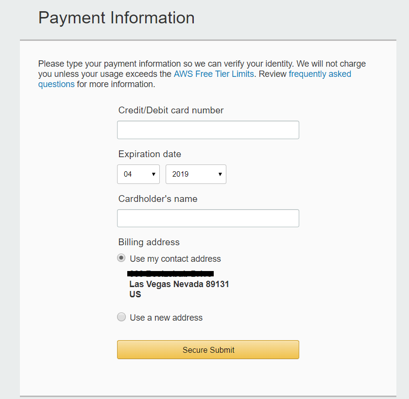
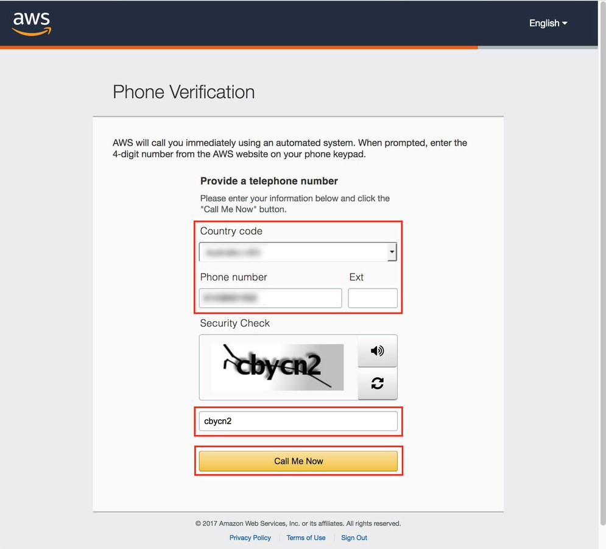
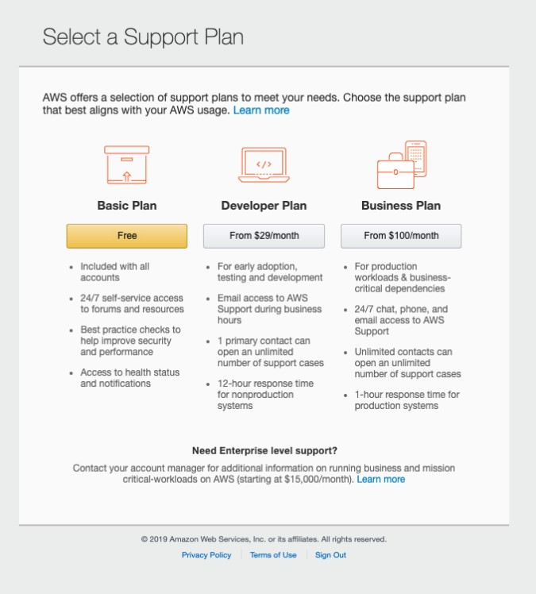
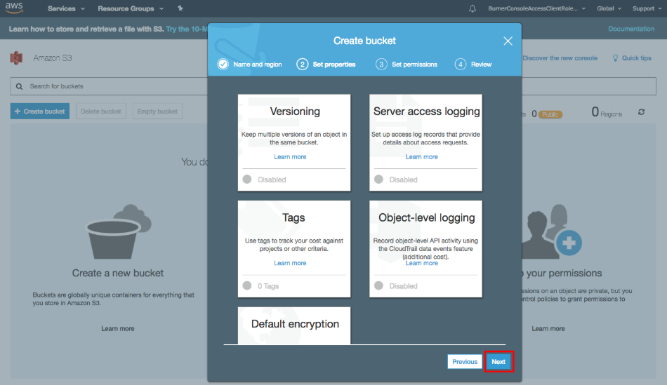
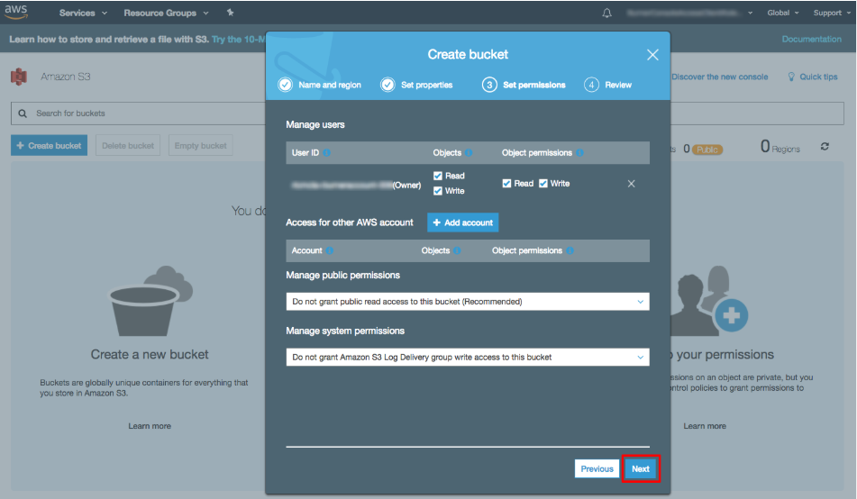
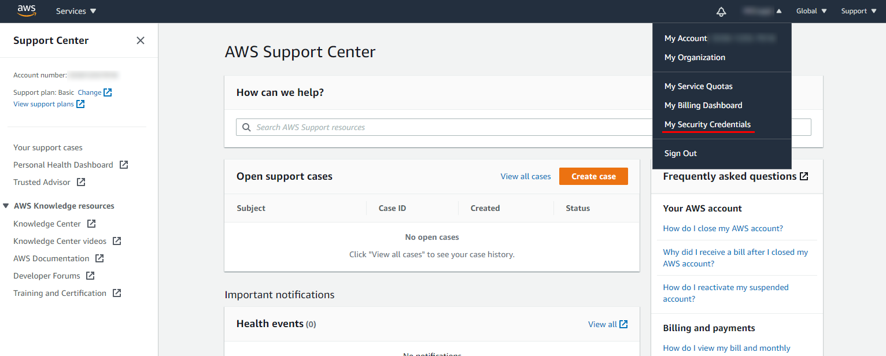
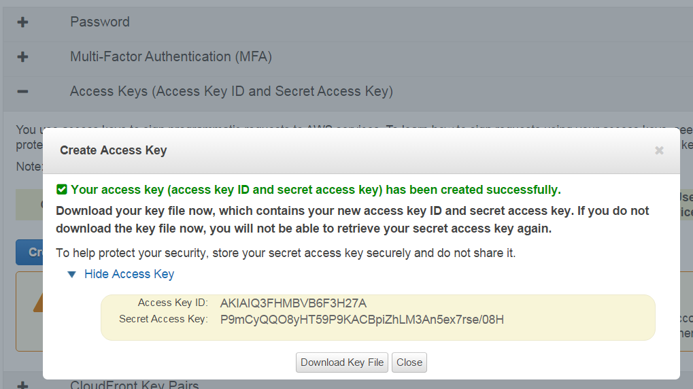

# Setup

The following describes how to create and configure an AWS account.

1. To create an AWS account, go to the [Create an AWS Account](https://aws.amazon.com/ru/) page and click the **Create Account** button.
2. Next, fill out the forms that the web service will offer.
3. Fill in your card details, this is done to verify your identity.
4. At one of the registration steps, you will be asked to enter a phone number and initiate a call to your phone using the **Call Me Now** button..

   You should answer the call and dial the code on the phone, which will be shown on the computer screen.
5. Next, you will be prompted to select a support plan. Upon completion of creating an account, you need to go to the management console
6. The first step in setting up an account is to create a Bucket.

   Bucket is a container for storing objects in the cloud. For Bucket, you need to set a unique name, and also select a regional data center (Region) where the data is physically stored. Please note that further when configuring the backup task: 1) in the **Storage** field, you will need to enter the bucket name, 2) in the **Address** field, you need to use not the name, but the address of the regional data center, which can be found [here](https://docs.aws.amazon.com/general/latest/gr/rande.html#s3_region). . Then continue the configuration.
7. Next, you need to set keys to programmatically access AWS services. To do this, go to the **Security Credential**s link in the AWS console.
8. Expand the **Access Keys (Access Key ID and Secret Access Key)** header and create access keys using the  button..

   The created keys can be saved to a file using the **Download Key File** button..

   Please note that when configuring a backup task, the **Access Key ID** must be used as a login and the **Secret Access Key** as a password.

## Recommended content

[Creating and configuring a task](HydraBackup_task.md)
