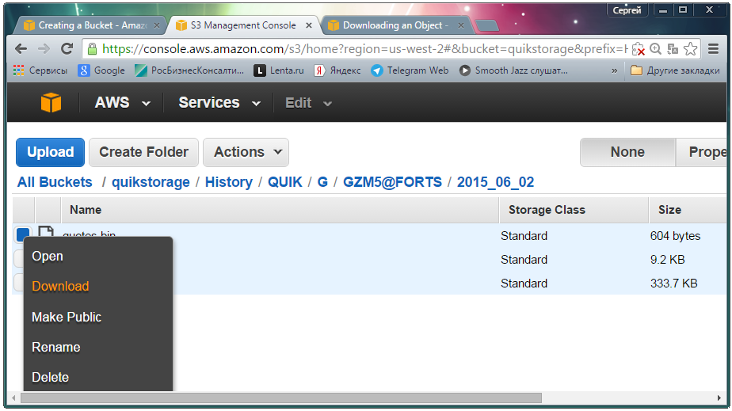

# Recovery

You can restore the data from the storage in two ways:

- To download stored objects from the AWS console. To do this, right\-click on the object and select **Download** in their context menu.

  > [!TIP]
  > This method allows to download only one object (file) at a time.
- To use the free application [S3 Browser](https://s3browser.com) for data downloading.
