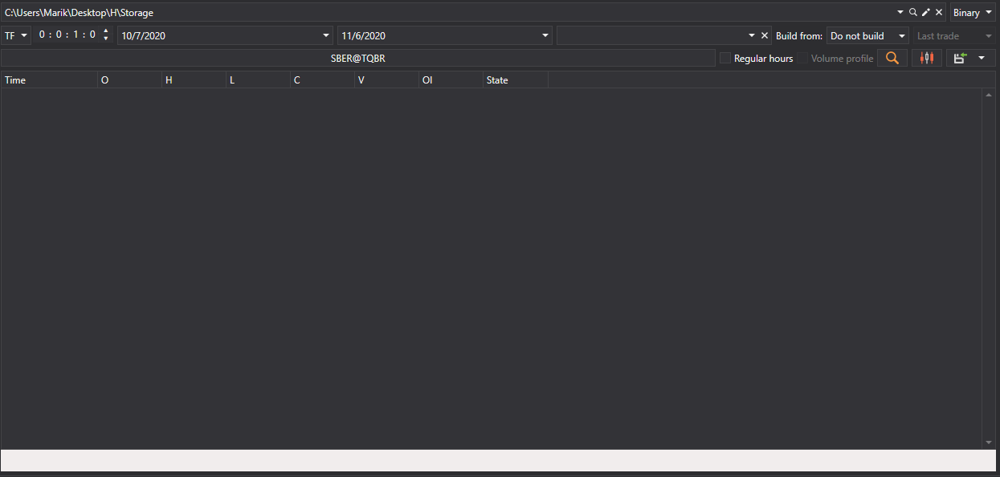
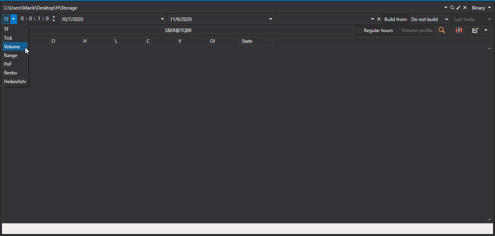
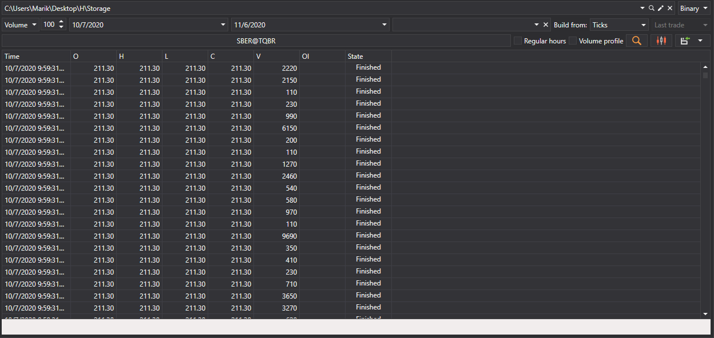
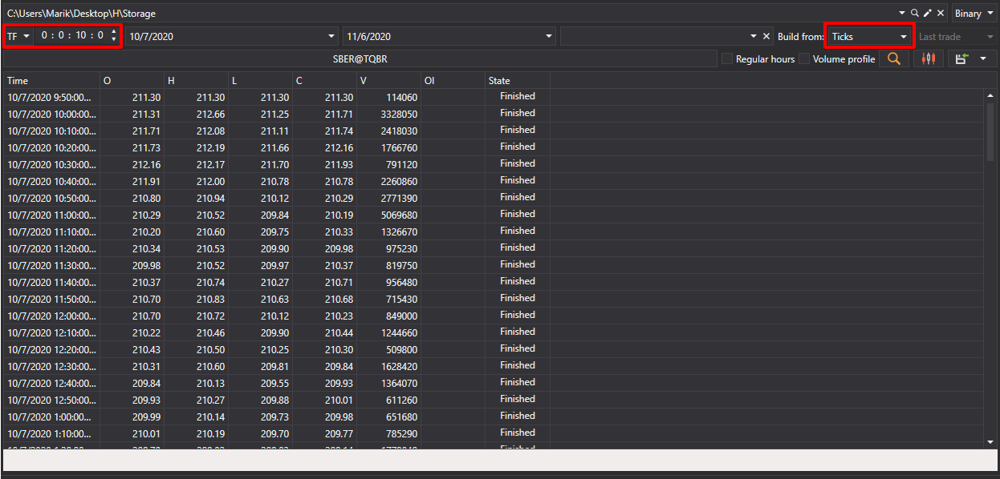
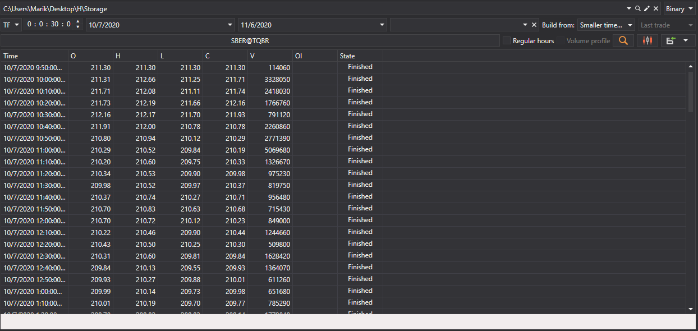
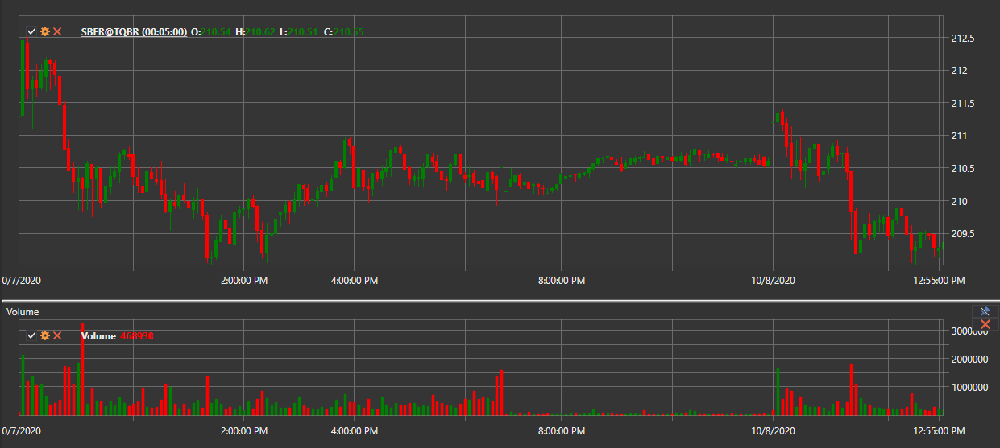
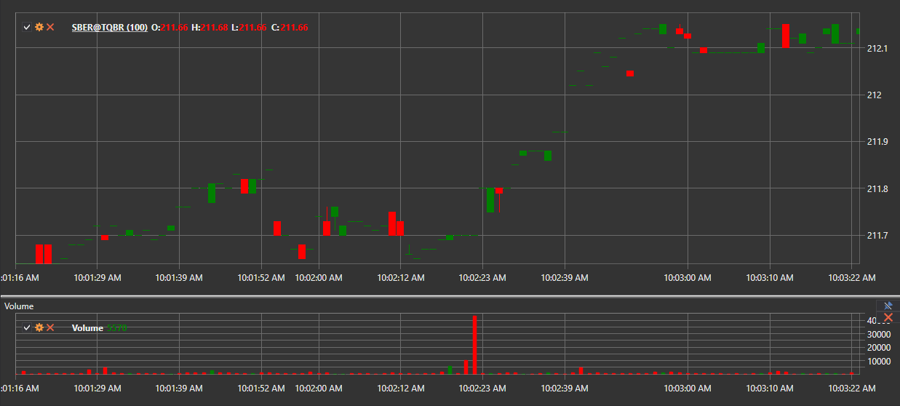
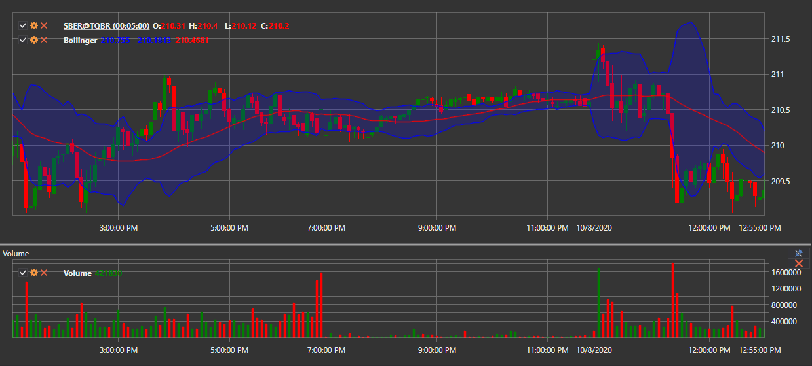

# Candles generation

[S\#.Data](Hydra.md) allows you to generate candles based on downloaded trades, which can later be exported to [Excel](https://en.wikipedia.org/wiki/Excel), xml, sql, bin, Json or txt formats (see below). 

This allows you to subsequently use the data in any technical analysis programs (WealthLab, AmiBroker, etc.).

### Candles generation

Candles generation

1. On the **Common** tab, click the **Candles** button, the following window will open:
2. Further it is necessary: 
   - Select the required candle type from the drop\-down list (all [standard candles](Candles.md) are supported) 
   - oSelect the required **Time Frame**

     As an example, we have selected candles with a Time Frame of 5 min.
   - Select an security (in our case it is SBER@TQBR) and click on the  button. 

   After that, candles will be generated based on the data found. For example, for candles of [TimeFrameCandle](xref:StockSharp.Algo.Candles.TimeFrameCandle) type the following will be generated: 

   If you need to build candles of a different type, for example [VolumeCandle](xref:StockSharp.Algo.Candles.VolumeCandle), you need to do the following:
   - Select the candle type. 
   - Select period, volume.
   - Set the security.
   - Select in **Build From**, for example **Ticks**. Click the  button.

   If the market data could not be received from the source, candles can be generated by selecting the data type from which they will be built in the [Build From](HydraUsingDifferentTypesMarketData.md) field.

   For example:
   - Candles with Time Frame 10 min from Ticks. 
   - You can build candles with a large Time Frame from candles with a smaller one by choosing in **Build From** to build **Smaller Time Frame**. For example, from candles with Time Frame 5 minutes candles with Time Frame 30 minutes

   > [!TIP]
   > If you select **do not build** in the **Build From** field, then ready\-made candles that were downloaded from the source will be searched for.
3. 3.If you need to graphically view the generated candles, then you need to click on the  button and after that the chart will open: 
4. You can add indicators to the chart. To do this, open the context menu by right\-clicking on the chart panel and select the **Indicator** item. In addition, the indicator can be displayed on a separate panel. To do this, add a new panel using the  button and also select the required indicator from the context menu.
5. The received values can be [exported to the required format](HydraExport.md).

**Watch [video tutorial](HydraBuildDifferentCandleType.md)**
