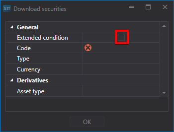
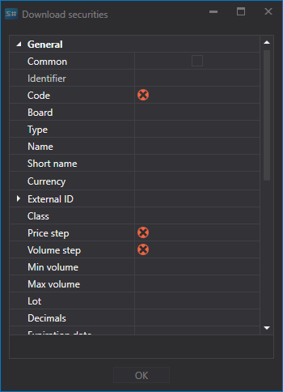
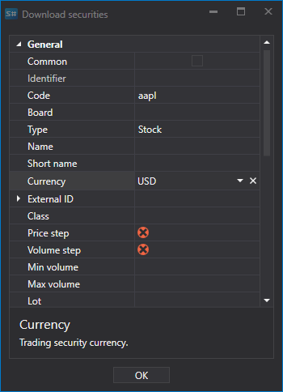
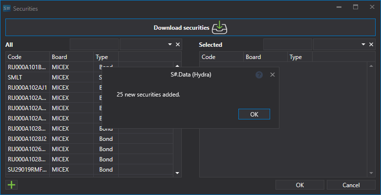
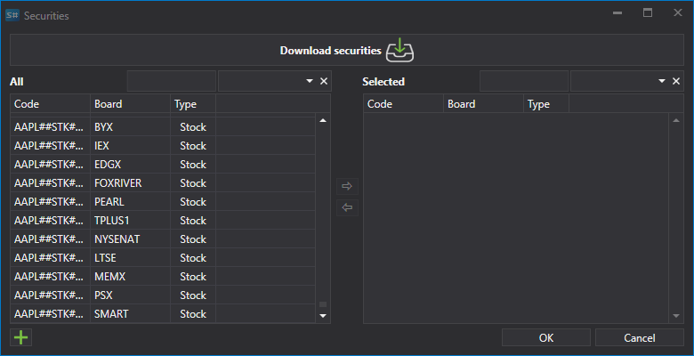
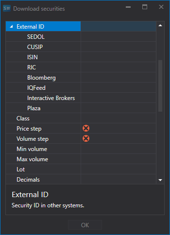
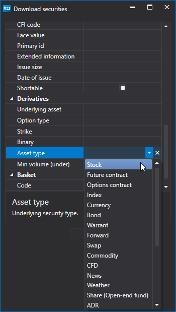

# Instruments list

Setting up the security for downloading.

For a number of sources, it is possible to make settings for downloading the necessary securities.

Let's take an example of downloading securities from the **Interactive Brokers** source: 

1. Select download securities and click on the **Extended condition** button.
2. After that, a list of advanced settings for the downloaded security will open.
3. You need to download an security that meets the following parameters: Stock of APPLE, currency \- US Dollar. To do this, we set the security parameters as shown below and click **OK**.

   After that, the [S\#.Data](Hydra.md) program will download all the securities that meet the specified parameters. 

Setting allows the user to select various parameters for the downloaded security. 

So, for example the user can select:

- **Price and volume step**
- **Minimum and maximum volumes**
- **External ID**
- For options, it allows setting the **Underlying Asset** and **Asset Type** (type of the underlying security).

**Watch [video tutorial](HydraSecuritiesCongfigDowVideo.md)**
