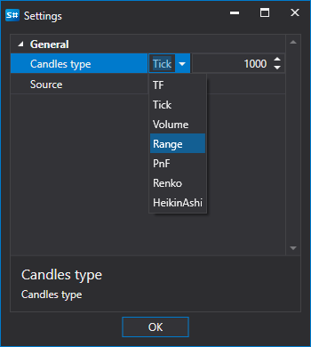
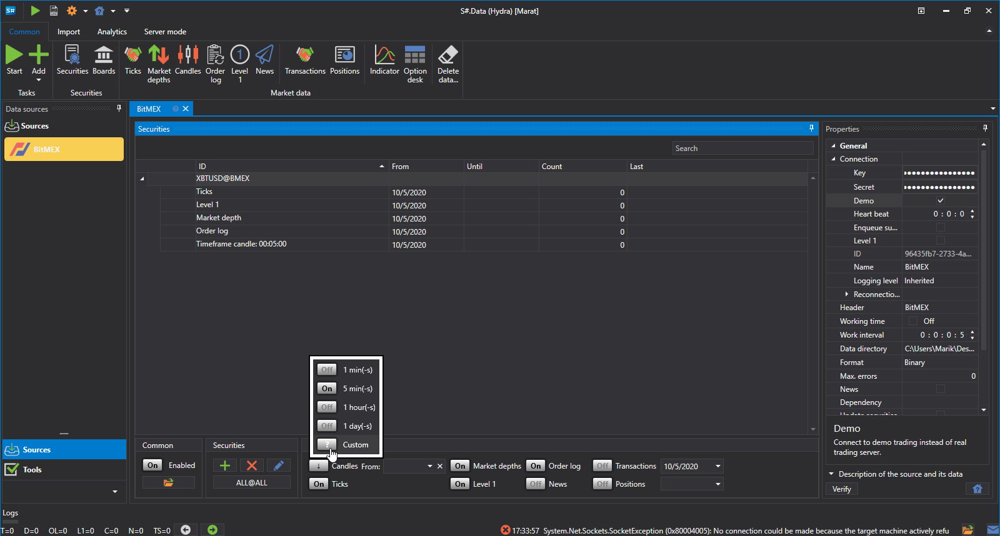
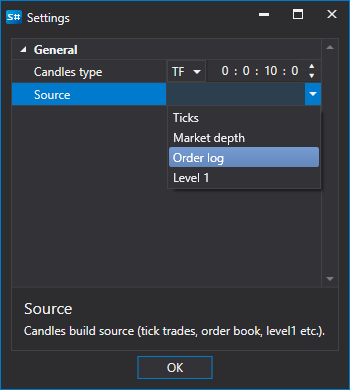
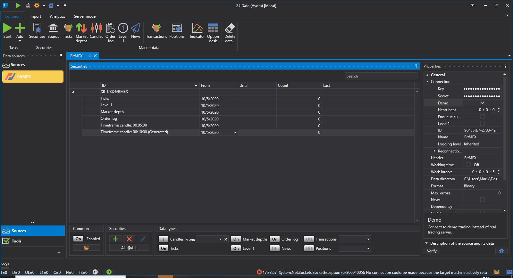
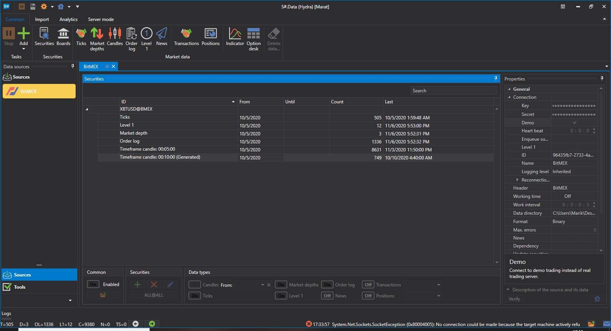
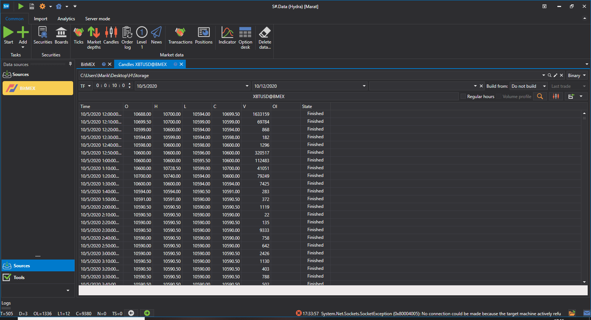
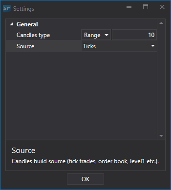
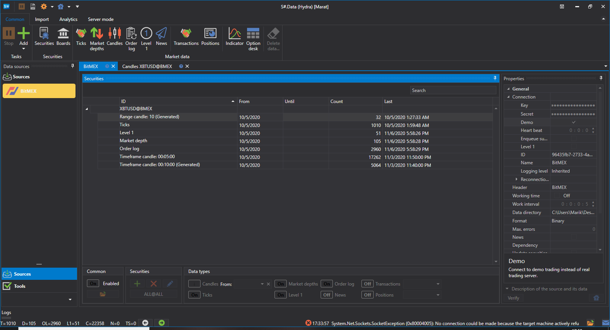
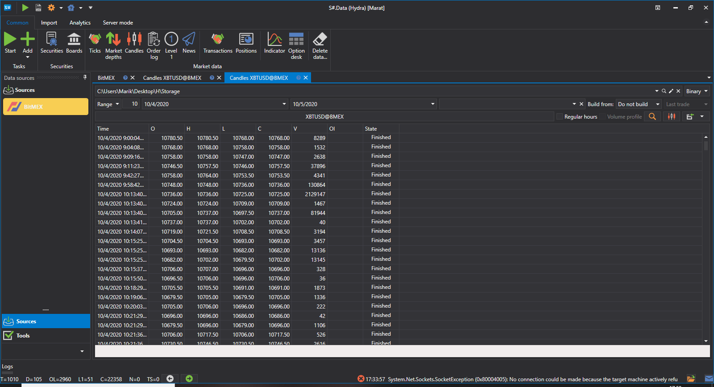

# Custom candles

The user can select a **Custom type** of candles and independently select which candles will be built, while the candles will be built "on the fly", that is, immediately.

Let's consider an example of such a building. **Bitmex** exchange does not provide a possibility to receive candles with a Time Frame of 10 minutes.

The sequence of obtaining such candles:

1. Select **Custom** candles
2. In the settings, we specify **TF** candles and a period of 10 minutes
3. In the source, we specify from what the candles will be built \- **Order Log** 
4. We set the period. As you can see, next to the candle name appeared the **Generated** indication..
5. Click on start and the data starts downloading.
6. Let's go to the candles section and [see the downloaded data](HydraViewingMarketData.md).

As you can see, the data has been successfully received.

Consider an example when we need to get a [RangeCandle](xref:StockSharp.Algo.Candles.RangeCandle):

1. Select **Custom** candles.
2. In the settings, specify the Range candles and the volume 10.
3. 3.In the source, we specify from what the candles will be built \- **Ticks**.
4. We set the period.
5. Click on start and the data starts downloading.
6. 6.Let's go to the candles section and [see the downloaded data](HydraViewingMarketData.md).
