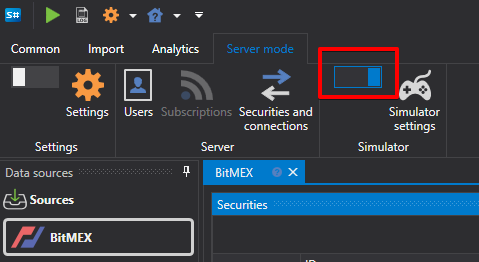
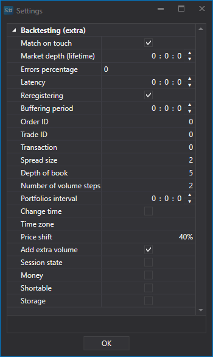

# Emulation setup

In server mode, the program allows you to enable emulation mode.

In emulation mode, the [S\#.Data](Hydra.md) program allows you to perform the following functions:

- The program allows you to configure the keys for connecting to the source and simultaneously work with one connection in different programs ([S\#.Designer](Designer.md), [S\#.Terminal](Terminal.md)). 
- If the market data source allows you to download historical data, then they can be used simultaneously for testing..
- If the source allows you to receive data in real time, then the emulation mode allows you to emulate the trading mode. In this mode, data on user actions (orders registering, trades) are transferred directly to S\#.Data , while actions are recorded separately for each program. For example, when registering an order in S\#.Terminal, changes to it will be visible only for it, and in S\#.Designer they will not be recorded. This avoids conflicts between two programs running over the same connection. 
- IMPORTANT\! Trades conducted in emulation mode, trading and operations on them are emulated in real time, when the mode is off, actions will be performed on real trading.

This mode is used when [testing strategies](Shell_emulation.md).

### Emulation settings.

- **Match on touch** \- when emulating trade matching, match orders when the trade price is equal to the order price.
- **Order book (time in force)** \- the maximum period of order book in the emulator. If the order book has not been updated within the specified period, its value is erased. It is used to remove old order book data if there are gaps in the data.
- **Percentage of errors** \- the percentage of errors in registering new orders (from 0 to 100).
- **Latency** \- the minimum latency of registered orders.
- **Re\-registration** \- whether re\-registration of orders will be supported as a single transaction.
- **Buffering period** \- a parameter that is responsible for the period of sending whole packets in order to emulate network latency and buffering the work of the exchange core
- **Order ID** \- the number with which the emulator will generate identifiers for orders.
- **Trade identifier** \- the number with which the emulator will generate identifiers for trades.
- **Transaction** \- the number with which the emulator will generate identifiers for order transactions.
- **Spread size** \- the spread size in price steps. It is used to determine the spread when generating the order book from tick trades.
- **Order book depth** \- maximum order book depth generated by ticks 
- **Number of volume steps** \- the number of volume steps by which the order is larger than the tick trade. It is used in testing on tick trades.
- **Portfolio interval** \- interval for recalculating data on portfolios. If the interval is 0, then no recalculation is performed.
- **Adjust time** \- adjust time for orders and trades to the exchange time.
- **Time zone** \- information about the time zone where the exchange is located
- **Price shift** \- a price shift from the last trade, which determines the boundaries of the maximum and minimum prices for the next session
- **Add additional volume** \- add additional volume to the order book when registering orders with a large volume.
- **Trading session state** \- checking the trading state.
- **Money** \- check the money balance 
- **Short** \- the ability to open short positions. 
- **Storage** \- storage.
