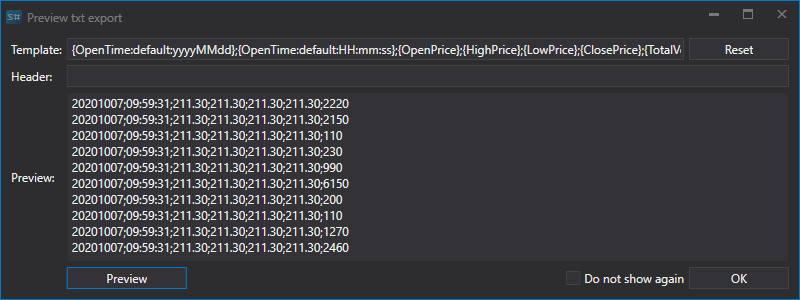

# Export data

[Hydra](Hydra.md) allows you to export the received market data in various formats, including [TSLab and MetaStock data formats](Hydra_Export_TSLab_MetaStock.md).

To export data, files in [Excel](https://en.wikipedia.org/wiki/Excel), xml, bin, txt, Json formats or SQL tables are used.

For export, you should select the required file format from the drop\-down list:

Then you have to select a folder and change the file name if necessary.

When exporting to text files (txt), a window appears in which you can specify the export template of the form: 

**{OpenTime:default:yyyyMMdd};{OpenTime:default:HH:mm:ss};{OpenPrice};{HighPrice};{LowPrice};{ClosePrice};{TotalVolume}**

Here, in curly braces, the properties to be exported and their order are indicated, separated by semicolons.

By clicking on the **Preview** button, you can see what data will be saved in the file.

The user can add additional properties such as instrument code via the **{SecurityId.SecurityCode}** property, or specify a Time Frame value.

You can add a header indicating the name of properties. In this case, the record will look like this.

If you need to export in a format using colons, you should specify the default keyword as in the example above **{OpenTime:default:HH:mm:ss}**.

**Watch [video tutorial](HydraDiffSaveFormat.md)**
