# First start

### The first time you run it, the following window will be displayed:

The first time you run it, the following window will be displayed:

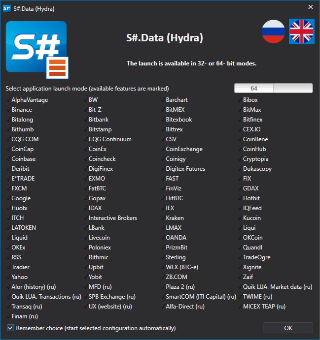

You have to select the start mode and click **OK**. 

Then the window for selecting data sources appears. You can also open this window in the **General** tab, you need to select **Add \=\> Sources**. 

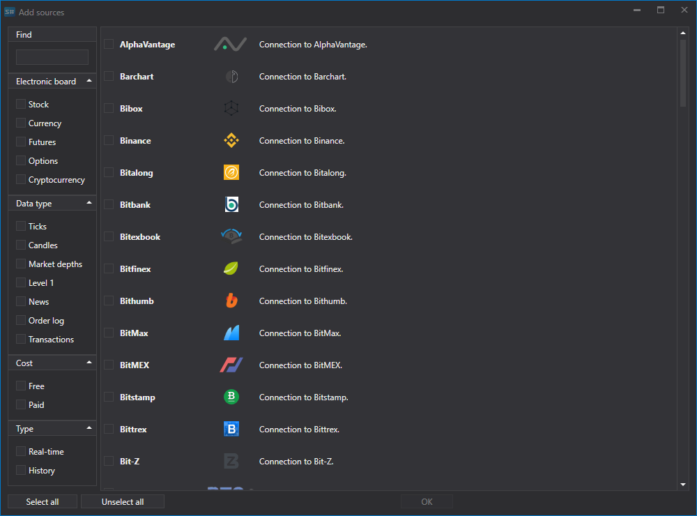

In the window, mark the required sources. You can use filters by region, board, data type, payment, real\-time or not. When the selection is complete, click **OK**. Then the program will offer to enable the utilities. For more details on working with the utilities, see the [Utilities](HydraTasks.md) section. Click **OK** . 

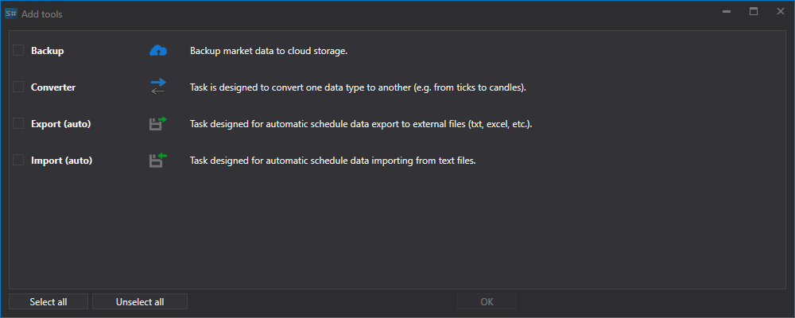

After that, the sources will be added to the left panel of the main application window. 

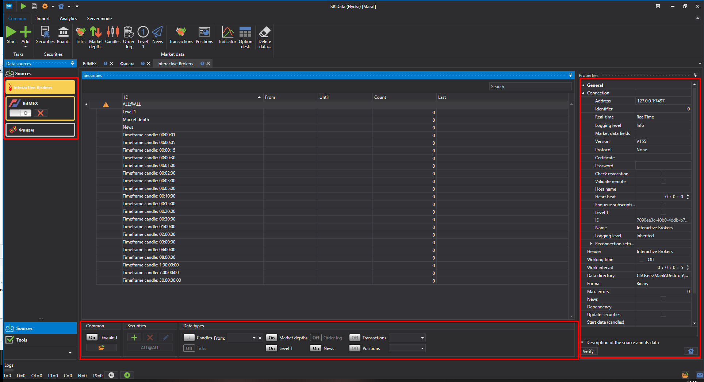

### Downloading a tool for uploading market data:

Downloading a tool for uploading market data:

Before you start downloading market data, you need to set up the securities for which you need to get market data.

After adding market data sources, panels of added sources will be opened in the central part, where a list of securities is displayed. If the panel is closed, then to open it, double click the source logo in the list on the left side of the program.

For example, download the SBER@TQBR securities (stock of Sber Bank) from the ФИНАМ source. 

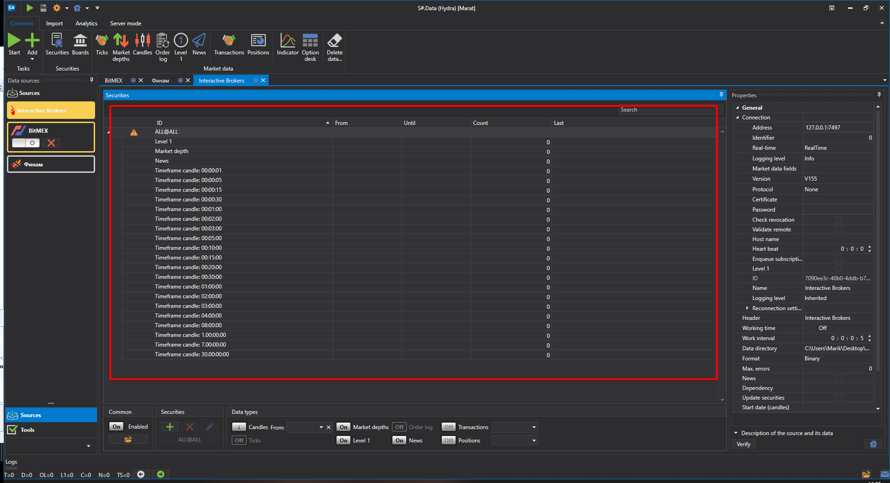

> [!TIP]
> IMPORTANT\! Data is downloaded only for the securities added to the securities list

1. Adding securities.

   At the first start, the program will offer to download all the securities at once for the selected source. Further, the user will download the securities himself. Initially, the security database in [S\#.Data](Hydra.md) is empty, there is only an auxiliary security **ALL@ALL**. When this security is selected, data will be downloaded for all available securities for this source. 

   To add an security, click on the **Add** button. Then a window for downloading security will open. 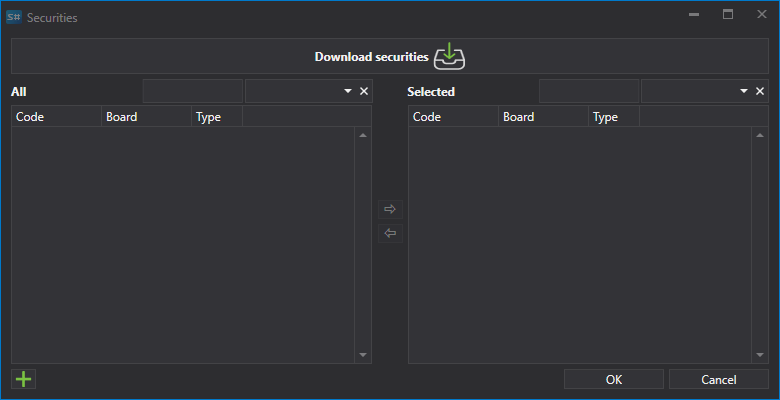

   To download the securities, you have to click the corresponding **Download securities** button. 

   After that, a menu will appear on the screen, in which the user can select **Download all securities**.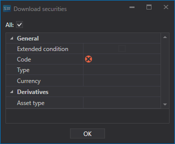

   Or, for a number of sources, [configure](HydraConfigurationSecuritiesDownload.md) the securities you need to download. 

   After the securities are received, the window will look like this.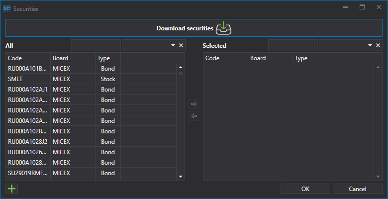

   It will list all the securities available for adding. For a quick search, you can enter its name in the appropriate field. 

   To select an security, double\-click on it and it will move to the right side of the list.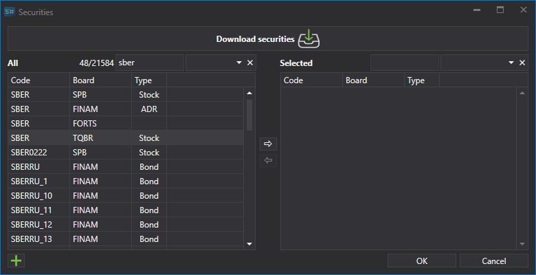

   Then it will move to the right side of the table..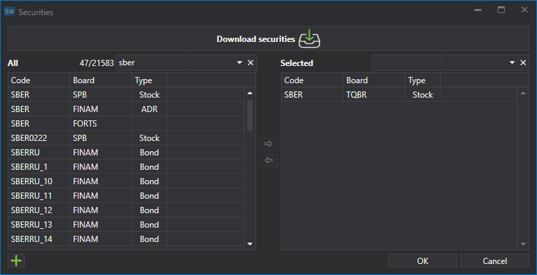

   The selected instruments will be displayed in the **Securities** table, which is a tree\-structured table. The main element of which is the security, the additional one is the market data types that will be received for this security.
2. For each selected security, you should select the market data types required for downloading.

   If all the necessary security parameters are not set, the icon  will appear in the left column of the security line. 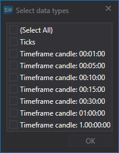

   Let's select to download **Ticks** and **Candles Time Frame 5**.

   At the bottom of the source window is a panel with buttons for setting up the data and instruments to be received. 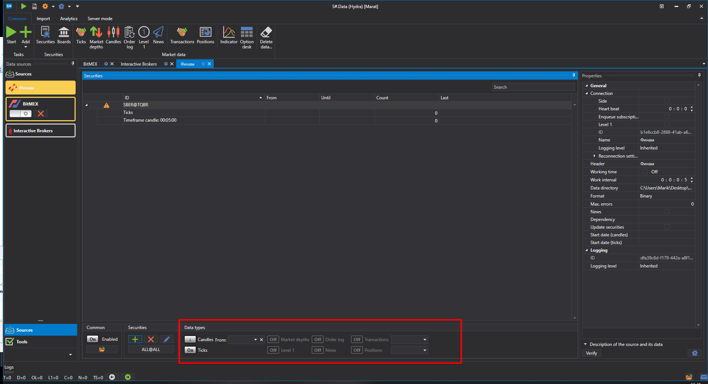

   The following operations can be performed at this panel: 
   - Configure the amount of information received using the buttons:**Trades, Order Books, Candles, Order Log, Level 1, Own Transactions**. Lists of available market data types vary for different sources. 
   - Specify the required Time Frame for the loaded candles. Time Frame of the received candles is different for different sources.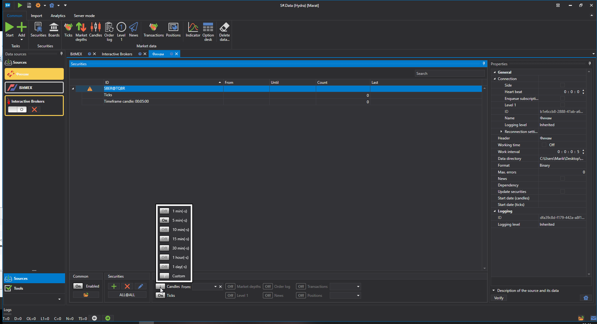
   - oSet the required period for downloading market data. Also, the period can be configured directly in the market data window. To do this, you should select the beginning and end of the period. 

     If the user does not specify the end date of the period, the program downloads all data available for the current date. If the source supports the transfer of market data in real time, then if there is no end date for the period, the market data will be downloaded in real time. 

     Let's set the period for which you need to download the market data.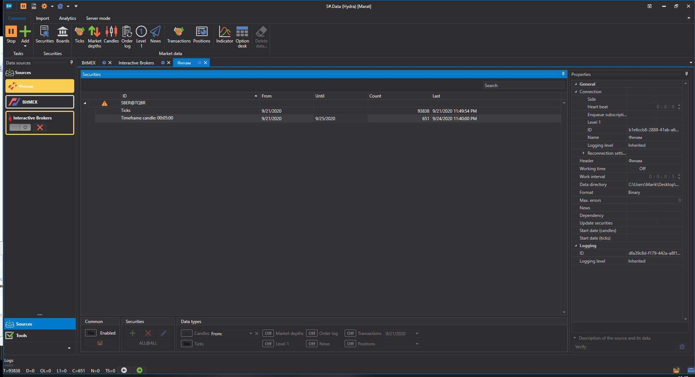
   - Specify what the market data will be built from. If this parameter is not specified, then the candles available in the source will be received. If the user specifies the market data type, then candles will be built from the specified market data type. For example, candles can be built from the last trade price, the order book spread (usually for the Forex market), volatility or the best price. 

     This function is convenient to use if the source does not allow receiving data for candle plotting. In this case, candles are plotted based on the averaged data values.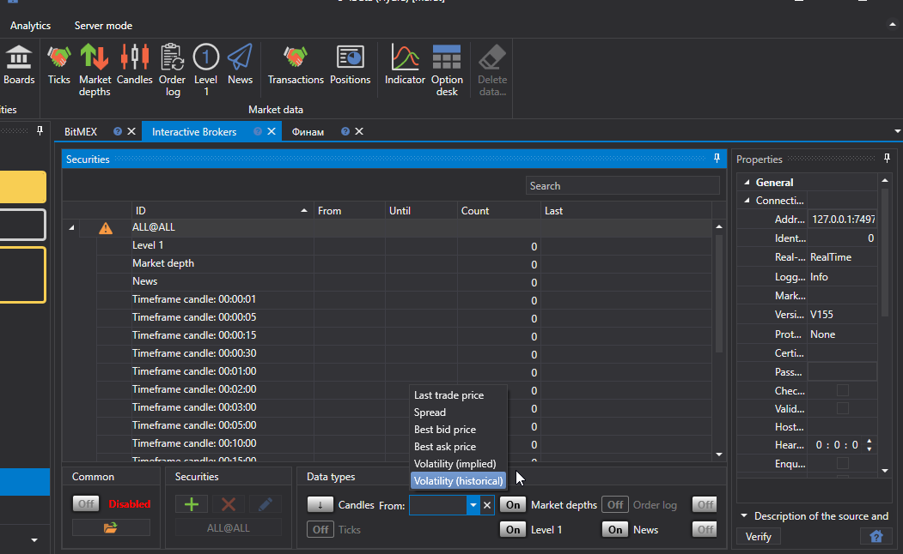

     The user also has the ability to select [Custom type](HydraCustomCandleType.md) of candles to customize the received data.
   - After selecting an security, market data type and setting the period, you should click on the **Start** button. After that, the market data download will begin. 

     The work process can be observed in the special **Logs tab**, which is fixed at the bottom of program. In addition, logs are stored in files in the local folder. 

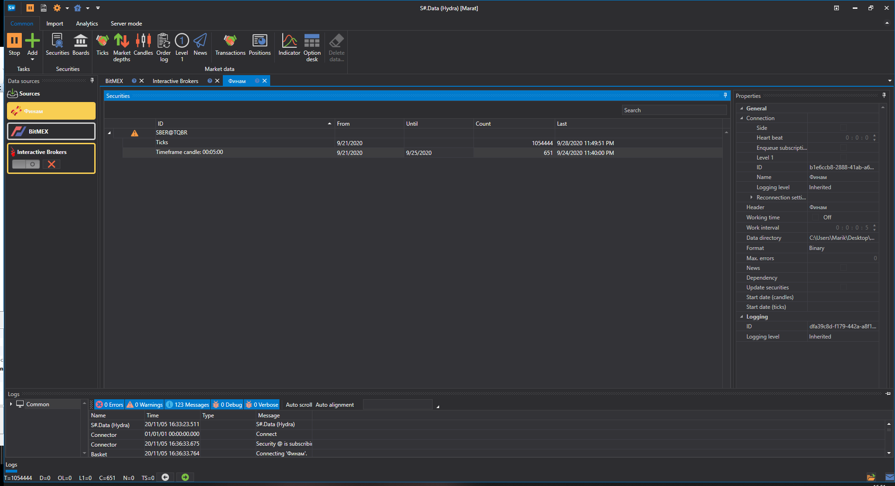

Also, the user can add [additional sources](HydraSourceSelection.md). . 

After the market data is downloaded, the user can [view market data](HydraViewingMarketData.md), [plot candles](HydraCandles.md) , save or [export in various formats](HydraExport.md).

**Watch [video tutorial](HydraFirstStartVideos.md)**.
