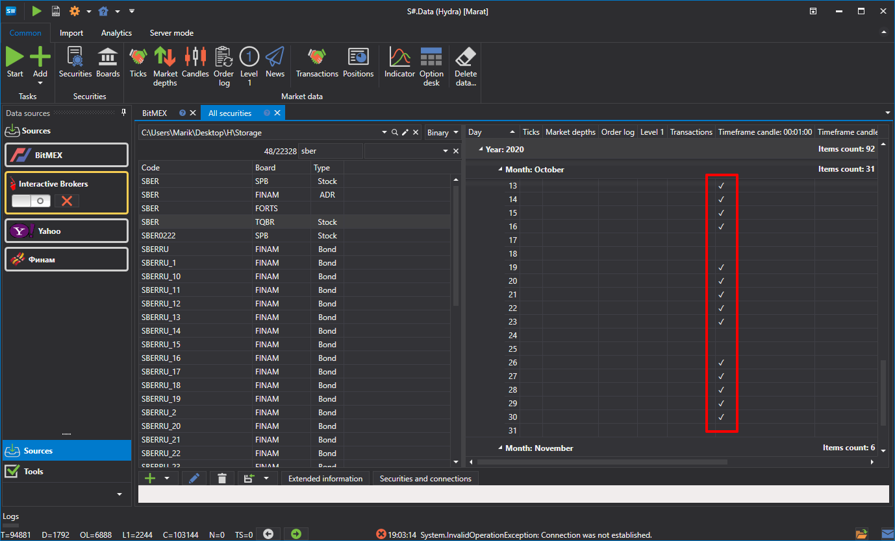
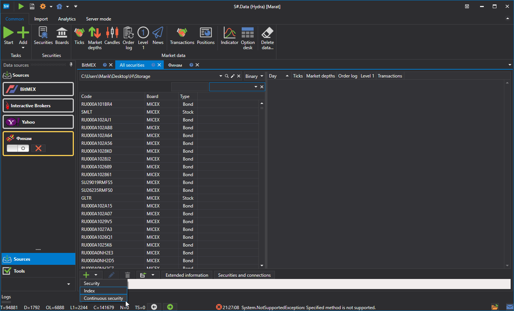
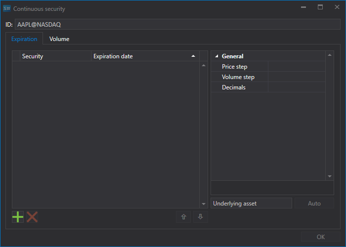
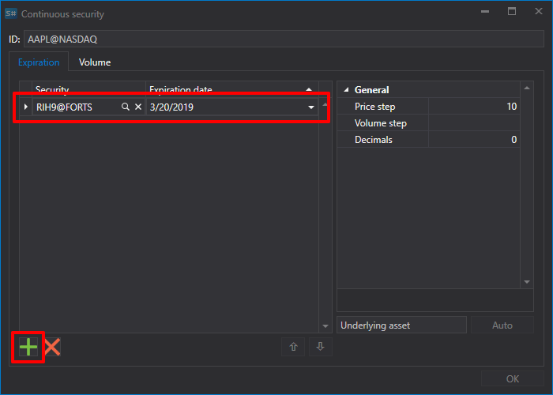
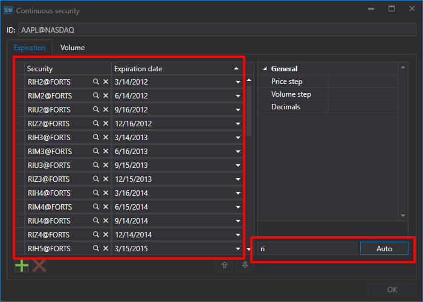
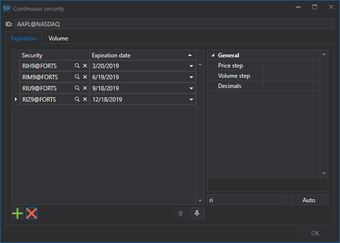
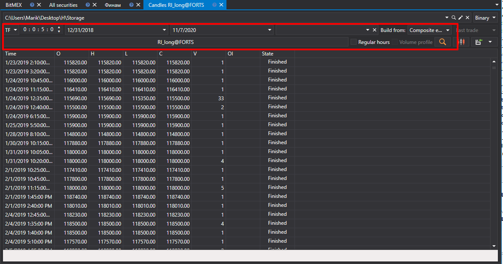

# Continuous futures

The [Hydra](Hydra.md) program allows the user to glue different types of market data on different contracts into one continuous instrument.

To do this, on the **Common** tab, select **Securities**, the **All securities** tab will appear. Before gluing the data, you need to check what market data is available. For this, the path is selected where the data is located and the instruments that are supposed to be glued are viewed in turn. If there are gaps, then you need to download the necessary market data (for example, from **Финам**).

As an example, we will consider gluing on an RTS index futures.

1. To create a continuous futures, click the **Create security \=\> Continuous security** button on the **All securities** tab.

   After that, the following window will appear:
2. 2.To create a continuous futures, you need to specify a name and add contracts.

   There are two ways to add contracts..
   - Manually by clicking the  button.
   - If you set the first two letters of the contract as a name, for example, RI, and click the **Auto** button, then all the instruments found in the database will be added.
3. We select the necessary contracts and set the transition dates. 
4. Next, assign the instrument identifier **RI\_long9@FORTS** and click the **OK** button, after which a new instrument will be created
5. Next, you need to click the [Candles](HydraExportCandles.md) button on the **Common** tab, select the resulting instrument, data period, set the **Composite element** value in the **Build from** field. Then click the  button. 

The generated data can be exported to Excel, xml, Json or txt formats. The export is performed using the drop\-down list

