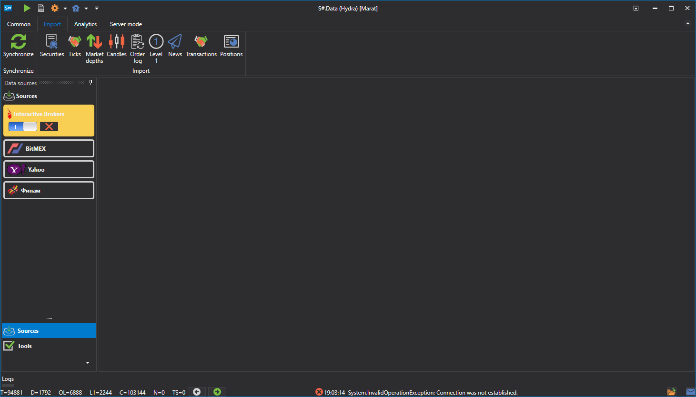

# Importing

[S\#.Data](Hydra.md) allows you to import your own data saved in the .csv format. To import, open the **Import** tab, and select the type of exchange data that you want to import.

The following types can be imported: 

- [Candles](HydraImportCandles.md)
- [Securities](HydraImportSecurities.md)
- [Trades](HydraImportTrades.md)
- [Order books](HydraImportDepths.md)
- [Order log](HydraImportOrderlog.md)
- [Level 1](HydraImportLevel1.md)
- [News](HydraImportNews.md)
- [Own transactions](HydraImportExecutions.md)

**Watch [video tutorial](HydraImportVideos.md)**
