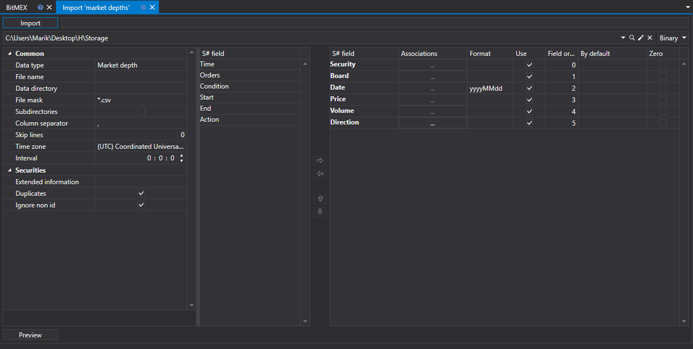
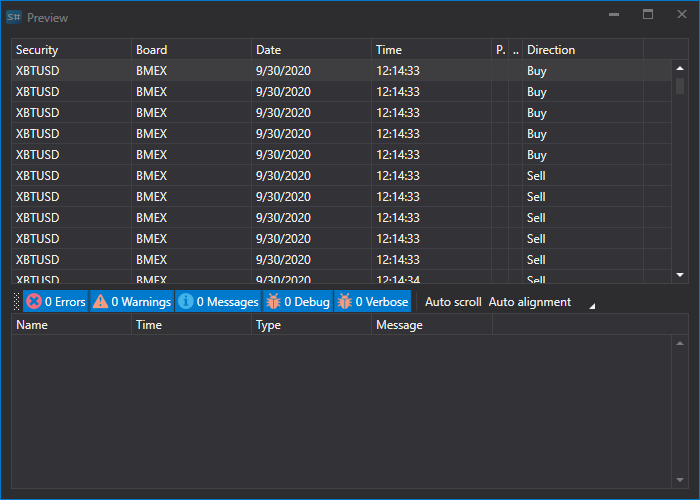

# Order books

To import order books, select **Import \=\> Order books** item from the main application menu.



### The import process securities.

1. **Import settings.**.

   See [Candles](HydraImportCandles.md) import.
2. Configure import parameters for [S\#](StockSharpAbout.md) fields.

   See [Candles](HydraImportCandles.md) import.

   **Let's consider an example of importing an order book from a CSV file:**
   - The file from which you want to import data has the following template:

     ```none
     {SecurityId.SecurityCode};{SecurityId.BoardCode};{ServerTime:default:yyyyMMdd};{ServerTime:default:HH:mm:ss.ffffff};{Quote.Price};{Quote.Volume};{Side}
     	  				
     ```

     Here the values of {SecurityId.SecurityCode} and {SecurityId.BoardCode} correspond to the values of **Security** and **Board**, respectively. Therefore, in the **Field order** field we assign the values 0 and 1, respectively.
   - For the {ServerTime:default:yyyyMMdd} and {ServerTime:default:HH:mm:ss.ffffff} fields, select the **Date** and **Time** fields from the **S\# field** window, respectively. We assign the values 2 and 3.
   - For the {Quote.Price} field, select the **Price** field from the **S\# field** window \- quote price. We assign it the value 4.
   - For the {Quote.Volume} field, select the **Volume** field from the **S\# field** window \- quote volume. We assign it the value 5
   - For the {Side} field, select the **Direction** field from the **S\# field** window \- the trade direction (Buy or Sell). We assign it the value 6.
   - oThe field setting window will look like this:

   The user can configure a large number of properties for the downloaded data. Based on the imported file template, you need to specify the property and assign it the required number in the sequence. 
3. To preview the data, click the **Preview** button.
4. Click the **Import** button.
