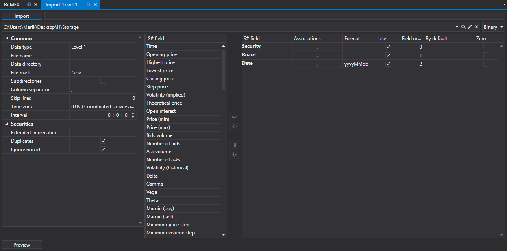
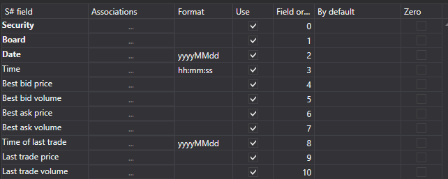
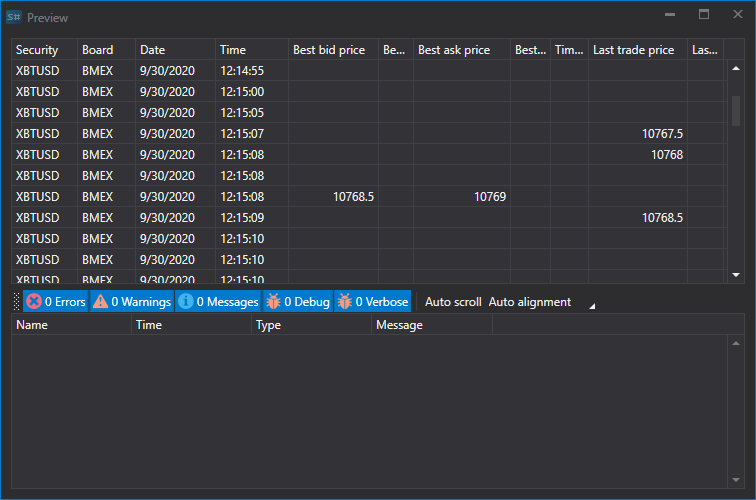

# Level 1

To import Level 1 data, select **Import \=\> Level 1** from the main application menu



### The import process securities.

The import process securities.

1. **Import settings.**.

   See [Candles](HydraImportCandles.md) import.
2. Configure import parameters for [S\#](StockSharpAbout.md) fields.

   See [Candles](HydraImportCandles.md) import.

   **Let's consider an example of importing an Level 1 from a CSV file:**
   - The file from which you want to import data has the following template:

     ```none
     {SecurityId.SecurityCode};{SecurityId.BoardCode};{ServerTime:default:yyyyMMdd};{ServerTime:default:HH:mm:ss.ffffff};{Changes:{BestBidPrice};{BestBidVolume};{BestAskPrice};{BestAskVolume};{LastTradeTime};{LastTradePrice};{LastTradeVolume}}
     	  				
     ```

     Here the values of {SecurityId.SecurityCode} and {SecurityId.BoardCode} correspond to the values of **Security** and **Board**, respectively. Therefore, in the **Field order** field we assign the values 0 and 1, respectively.
   - For the {ServerTime:default:yyyyMMdd} and {ServerTime:default:HH:mm:ss.ffffff} fields, select the Date and **Time** fields from the **S\# field** window, respectively. We assign the values 2 and 3.
   - For the {BestBidPrice} field, select the **Best buy price** field from the**S\# field** window. We assign it the value 4..
   - For the {BestBidVolume} field, select the **Best buy volume** field from the **S\# field** window. We assign it the value 5.
   - For the {BestAskPrice} field, select the **Best sale price** field from the **S\# field** window. We assign it the value 6.
   - For the {BestAskVolume} field, select the **Best sale volume** field from the **S\# field** window. We assign it the value 7.
   - For the {LastTradeTime} field, select the **Last trade time** field the **S\# field** window. We assign it the value 8.
   - For the {LastTradePrice} field, select the **Last trade price** field from the **S\# field** window. We assign it the value 9.
   - For the {LastTradeVolume} field, select the **Last trade volume** field from the **S\# field** window. We assign it the value 10.
   - The field setting window will look like this:

     

   The user can configure a large number of properties for the downloaded data. Based on the imported file template, you need to specify the property and assign it the required number in the sequence. 
3. 3.To preview the data, click the **Preview** button.

   
4. Click the **Import** button..
