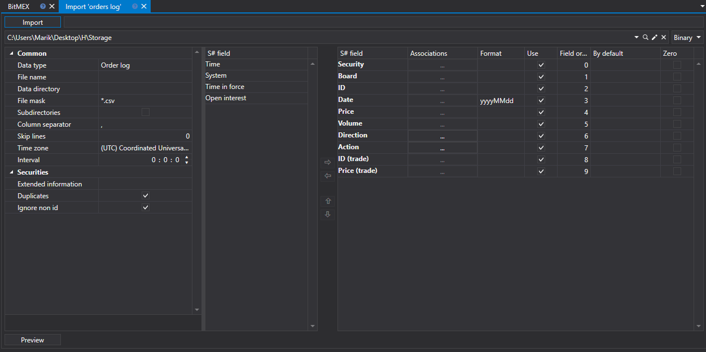
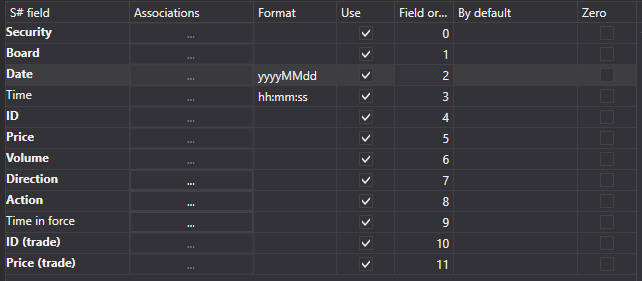
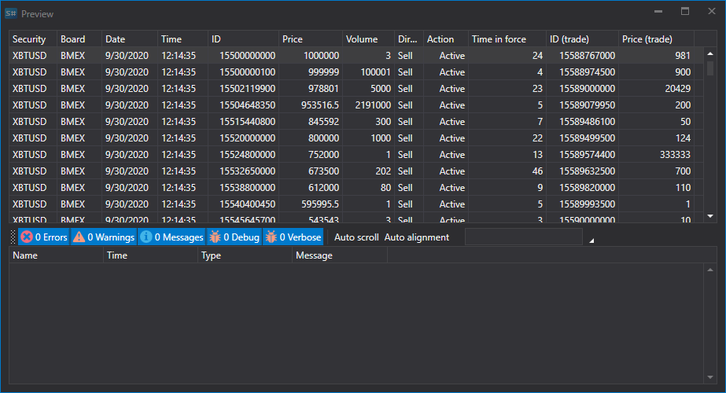

# Order log

To import the order log, select the **Import \=\> Order log** item from the main application menu.



### The import process securities.

The import process securities.

1. **Import settings.**.

   See [Candles](HydraImportCandles.md) import.
2. Configure import parameters for [S\#](StockSharpAbout.md) fields.

   See [Candles](HydraImportCandles.md) import.

   **Let's consider an example of importing an Order Log from a CSV file:**
   - The file from which you want to import data has the following template:

     ```none
     {SecurityId.SecurityCode};{SecurityId.BoardCode};{ServerTime:default:yyyyMMdd};{ServerTime:default:HH:mm:ss.ffffff};{OrderId};{OrderPrice};{OrderVolume};{Side};{OrderState};{TimeInForce};{TradeId};{TradePrice}
     	  				
     ```

     Here the values of {SecurityId.SecurityCode} and {SecurityId.BoardCode} correspond to the values of **Security** and **Board**, respectively. Therefore, in the **Field order** field we assign the values 0 and 1, respectively.
   - For the {ServerTime:default:yyyyMMdd} and {ServerTime:default:HH:mm:ss.ffffff} fields, select the **Date** and **Time** fields from the **S\# field** window, respectively. We assign the values 2 and 3.
   - For the {OrderId} field, select the **ID** field from the **S\# field** window \- order ID. We assign it the value 4.
   - For the {OrderPrice} field, select the **Price** field from the **S\# field** window \- order price. We assign it the value 5
   - For the {OrderVolume} field, select the **Volume** field from the **S\# field** window \- order volume. We assign it the value 6.
   - For the {Side} field, select the **Direction** field from the **S\# field** window \- order direction (buy or sell). We assign it the value 7.
   - For the {OrderState} field, select the **Action** field from the **S\# field** window \- the order state (active, inactive or error). We assign it the value 8.
   - For the {TimeInForce} field select the **Time** in force from the **S\# field** window \- a condition of limit order execution. We assign it the value 9.
   - For the {TradeId} field, select the **ID (trade)** field from the **S\# field** window \- the trade identifier. We assign it the value 10.
   - For the {TradePrice} field, select the **Price (trade)** field from the **S\# field** window \- the trade price. We assign it the value 11.
   - The field setting window will look like this:

   The user can configure a large number of properties for the downloaded data. Based on the imported file template, you need to specify the property and assign it the required number in the sequence. 
3. To preview the data, click the **Preview** button.
4. 5.Click the **Import** button.
