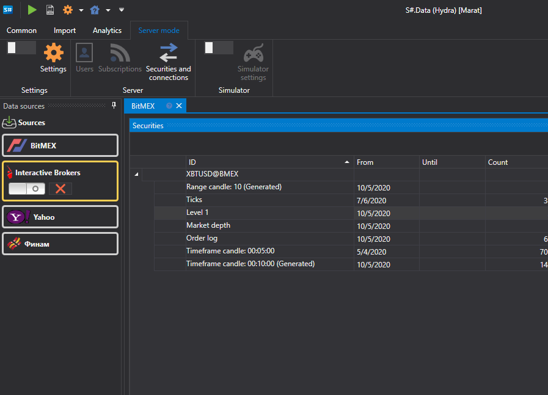
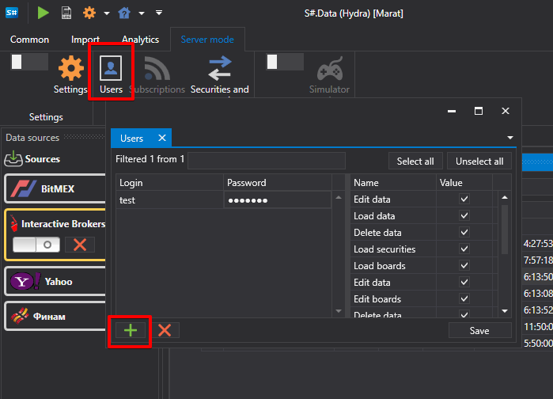

# Settings

[Hydra](Hydra.md) can be used in server mode, in this mode you can remotely connect to [Hydra](Hydra.md) and get the existing data in the storage. You can connect to [Hydra](Hydra.md) running in server mode from [Designer](Designer.md) (see [Getting started](Designer_Creating_repository_of_historical_data.md) in the [Designer](Designer.md) documentation for how to do this). You can also connect to [Hydra](Hydra.md) via [API](StockSharpAbout.md) (how to do this is described in the [FIX\/FAST connectivity](hydraAPIConnect.md) items).

In server mode, the [Hydra](Hydra.md) program allows the user to work using one connection, with several programs at once. By setting the access key in the program settings, the user can simultaneously work with one source under one account.

Actually, the connection to the source occurs via [Hydra](Hydra.md), to which, for example, [Designer](Designer.md), [Terminal](Terminal.md) are simultaneously connected. This method allows you to avoid reconnection between programs, purchase of an additional connection. With such work, conflicts are excluded, the occurrence of which is due to the orders registering or trades from different programs. [Hydra](Hydra.md) receives the signal and passes the result back to the program from which it was received, while the sequence of other work is not disturbed. 

To enable [Hydra](Hydra.md) server mode, select the **Server mode** tab in the top menu of program.

After that, click on the **Settings** button to open the server mode settings window.

**Hydra Server**

- **FIX server** \- switch [Hydra](Hydra.md) to server mode, distributing live trading and historical data via the FIX protocol. 

  In this settings section, the user configures the connection for working with sources: 
  1. **ConvertToLatin** \- convert Cyrillic to Latin 
  2. **QuotesInterval** \- quotes update period 
  3. **TransactionSession** \- setting of a trading session. Setting up for trading via the [Hydra](Hydra.md) program. 

     The setting allows to set up: Dialect of the FIX protocol, Sender and Recipient, Data format and other settings. See [FIXServer properties](https://doc.stocksharp.ru/html/Properties_T_StockSharp_Fix_FixServer.htm) for details.
  4. **MarketDataSession** \- settings for transfer of market data received using [Hydra](Hydra.md). See Подробнее см. [FIXServer properties](https://doc.stocksharp.ru/html/Properties_T_StockSharp_Fix_FixServer.htm) for details. 
  5. **KeepSubscriptionsOnDisconnect** \- keeping subscriptions when disconnected from the source. 
  6. **DeadSessionCleanupInterval** \- after what time interval the information will be cleared if the connection is disconnected.
- **Authorization** \- authorization to gain access to the Hydra server 
- **Number of securities** \- the maximum number of instruments that can be requested from the server 
- **Candles (days)** \- the maximum number of days available to download candle history 
- **Ticks (days)** \- the maximum number of days available to download the tick data history 
- **Order books (days)** \- the maximum number of days available to download order book history 
- **OL (days)** \- the maximum number of days available to download the OL data history 
- **Transactions (days)** \- the maximum number of days available to download the transaction history 
- **Simulator** \- turn on simulator mode 
- **Security maping** \- enable the transfer mode of only specified instruments. 

If you set **Authorization** other than **Anonymous**, the **Users** button will appear on the **Common** tab, after clicking on which the **Users** window appears

On the left side of window, you can add a new user, and on the right, set access rights for him. 
