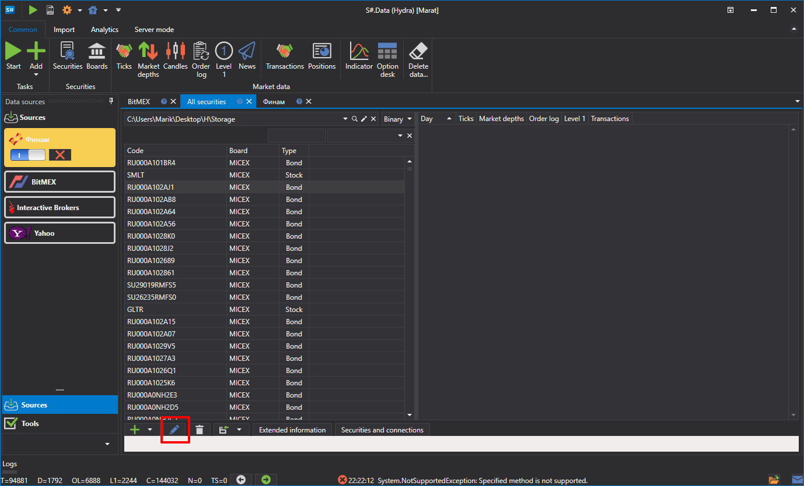
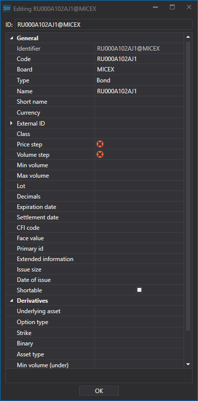
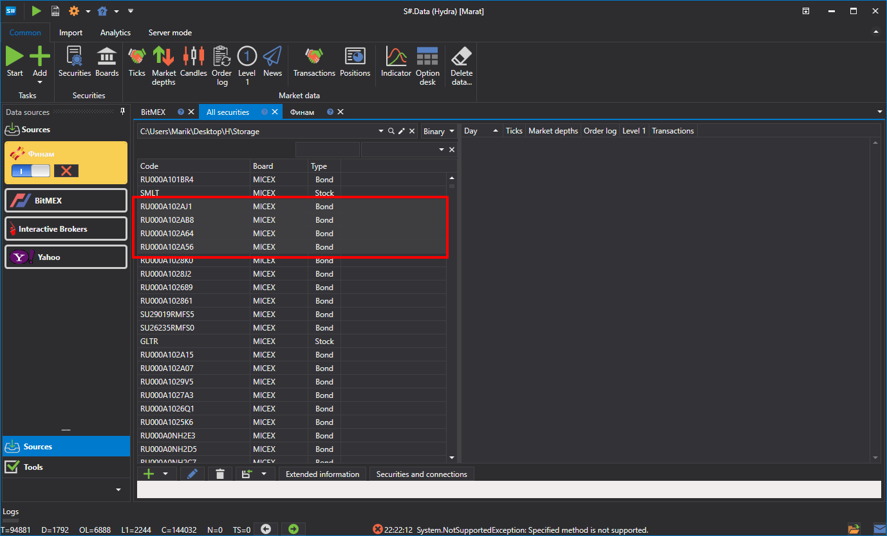
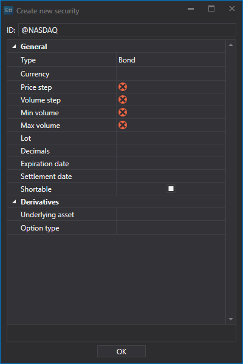

# Editing instruments

To edit an instrument (for example, when the instrument was not filled with all the necessary data), double click the instrument or click the  button to open the window in which to perform the necessary settings: 

Go to the **Securities** window.

Then a window for editing will open..

If necessary, you can edit the instrument group. To do this, select an instrument group and click on the  button. 

Then you can edit the group.

If the selected instrument group has the same values, this field will be filled with this value. If the values are different, then this field will be empty. For example, two instruments are selected with the Price Step value equal to 1, one instrument has a lot size of 10, the other \- 100. Accordingly, the Price Step field will be 1, and the Volume Step field will be empty. 

## Recommended content
