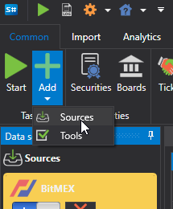
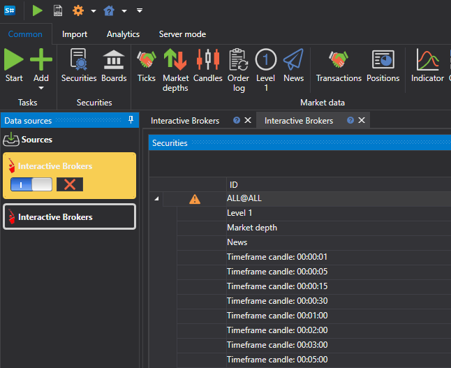
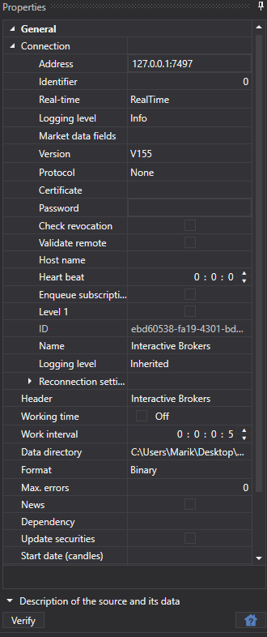

# Select source

To add a new market data source, you need to:

- Go to the **Common** tab
- Select **Add**
- Select **Sources**

Then a list of sources will appear. The user can select several sources at once. 

You can also create multiple instances of the same source. For example, multiple instances of **Interactive Brokers** that will save downloaded data to different folders.

In order for the source to start downloading data after clicking the **Start** button, it should be enabled. To do this, select the source icon in the left panel and use the  button to switch it on or off. You can perform this operation before or after adding instruments for downloading.

Unnecessary sources can be deleted using the  button.

Source settings can be changed in the **Properties** panel on the right side.

Common settings for all sources can be found in the [Common connection settings](HydraCommonConnectionSettings.md) item.

Each connection has its own characteristics, the link [List of connectors](HydraDataSource.md) provides a list of connectors and their settings.

**Watch [video tutorial](HydraConnectingSetup.md)**
