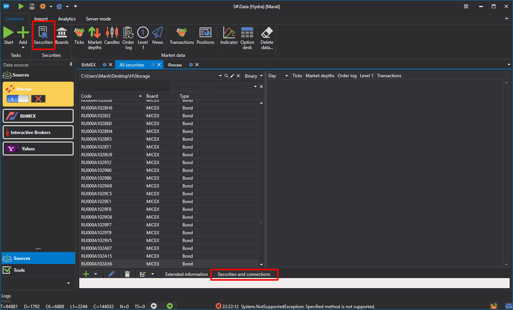
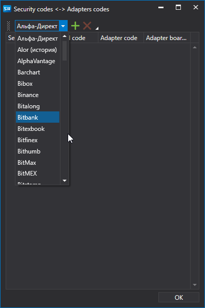
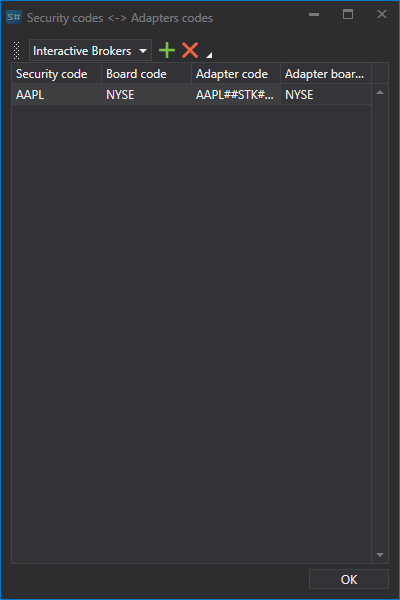
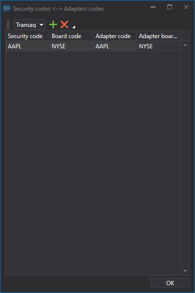
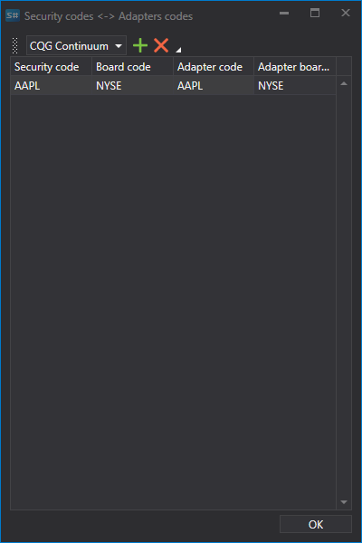

# Matching instruments\-connections

The same instrument in different trading systems can be called differently. It is possible to match the instrument and the connections via which this instrument will be traded, and specify how it is identified in the external trading system.

This allows you to organize the received data and simplify storage. Actually, all incoming data from various sources will be consolidated in one place and not by the source name, but by the instrument name..

This is also useful when trading the same instrument on different trading boards or via different connections (or brokers). Also, it allows to get data from one connection, and make trades via another connection..

To match instruments and connections you need:

1. Go to the **Securities** tab and click the **Securities and connections button**.
2. In the list of connections, select the required connection.
3. We fill in all the columns.

   For example:

   APPLE stock instrument.
   - Connection \- **Interactive Brokers**. Click on the  button, after which a new line will be added. 
   - In the **Security** code and **Board code** columns, specify the instrument code and board code. In the columns **Security code in adapter** and **Board code in adapter** specify the instrument code and the board code as they are specified in the external trading system. Click **OK** 
   - We repeat the steps for the **Transaq** and **CQG Continuum** connections in the same way. 

   | **Transaq**                                                                       | **CQG Continuum**                                                                 |
   | --------------------------------------------------------------------------------- | --------------------------------------------------------------------------------- |
   |  |  |
4. Now all downloaded data, in our case for APPLE shares, will be saved in one place 
