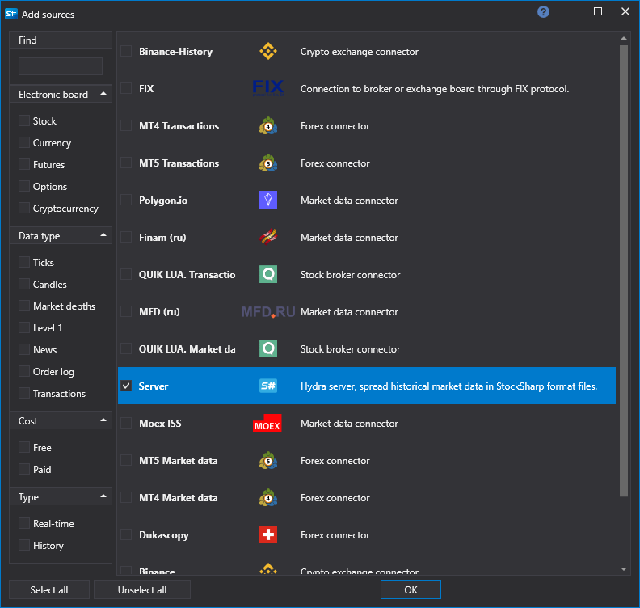
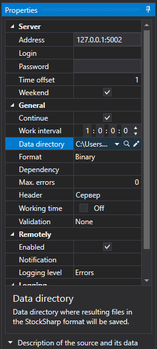

# Connecting a Hydra Client

In server mode, it's possible to connect another Hydra program, which will act as a client and download data to itself. Unlike [Connecting via FIX protocol](hydraAPIConnect.com), data is transmitted in the form of files in StockSharp format. This makes the source suitable for transferring a large volume of historical data.

A special source is used for connection:

**Settings**

- **Address** - the address of the Hydra server.
- **Login** - login (required if the server requires authorization).
- **Password** - password (required if the server requires authorization).
- **Time Offset** - A time offset in days from the current date, necessary to prevent downloading incomplete data for the current trading session.
- **Weekends** - whether to download data for weekends.

**Main**

- **Title** - the title of the task.
- **Working Hours** - setting the operation of the platform.
- **Interval of Operation** - operation interval.
- **Data Directory** - the directory with data where the final files in [S#](StockSharpAbout.com) format will be saved.
- **Format** - the format of data: BIN/CSV.
- **Max. Errors** - the maximum number of errors, upon reaching which the task will be stopped. By default, 0 - the number of errors is ignored.
- **Dependency** - a task that must be completed before starting the current one.

**Logging**

- **Identifier** - identifier.
- **Logging Level** - the level of logging.