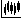

# Any market data types

[S\#.Data](Hydra.md) allows you to use another type of data to get a number of market data.

This is necessary if the source does not allow downloading the required market data. So, for example, several types of market data can be used at once to build the **Order book**.

IMPORTANT\! **Order book** can be built from the **Order Log** or **Level 1**, provided that these data types contain the best prices.

It is worth remembering that **Level 1** values can be downloaded from any source that provides real\-time market data. **Level 1** can also be received by [converting](HydraTasksConverter.md) from the **Order book**. 

To build you need:

1. Select the period and instrument for which you want to get market data.
2. Select the **Build from** field and select the required data type

   IMPORTANT\! If **Order Book, Order Log, Level 1** are selected as a source for building a candle, a selection of additional parameters appears.
3. After setting, you need to click on the  button.

To build **Candles**, the option of building candles of a larger Time Frame from candles of a smaller Time Frame is also available. 

So, for example, if there are candles with a Time Frame of 1 minute, you can build candles with a Time Frame of 5 minutes from them by selecting the appropriate type in the **Build from** line. 

**Watch [video tutorial](HydraBuildMarkethDepthLogLevel.md)**
