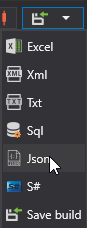
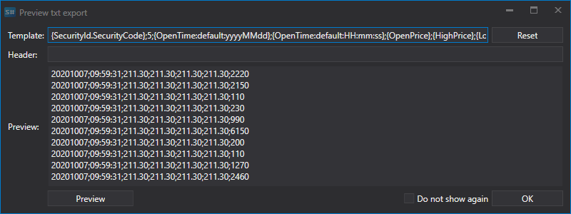

# Export into MetaStock

To export data to MetaStock format files, select the Txt format from the drop\-down list:



When exporting to text format (Txt) files, a window appears: 



In which you need to specify the export template, where the curly brackets indicate the properties that need to be exported, and their order: 

```none
{SecurityId.SecurityCode},5,{OpenTime:yyyyMMdd},{OpenTime:HHmmss},{OpenPrice},{HighPrice},{LowPrice},{ClosePrice},{TotalVolume}
	  				
```

In the example, the timeframe of the candles in 5 minutes is indicated in the second place. 

Also, the first line (Header) should be set in the file: 

```none
\<TICKER\>,\<PER\>,\<DATE\>,\<TIME\>,\<OPEN\>,\<HIGH\>,\<LOW\>,\<CLOSE\>,\<VOL\>
	  				
```

## Recommended content
