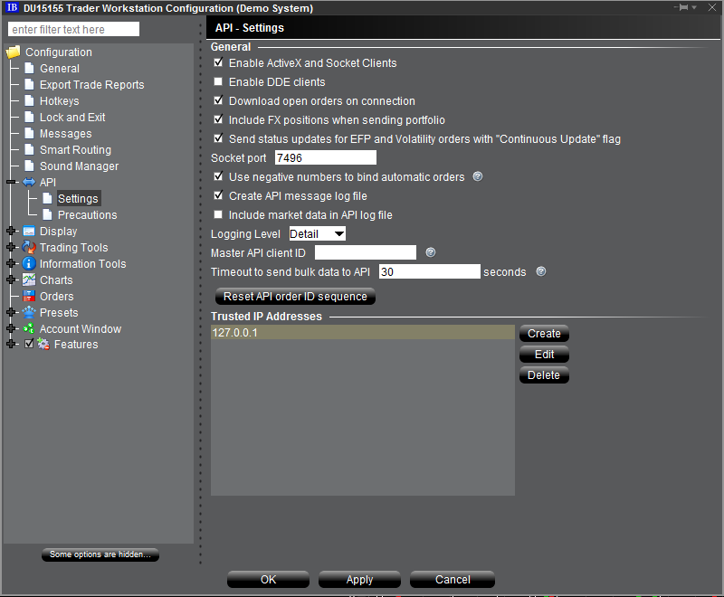

# Configuration Interactive Brokers

To work correctly with [InteractiveBrokersTrader](xref:StockSharp.InteractiveBrokers.InteractiveBrokersTrader) you should preset [TWS](https://interactivebrokers.com/en/index.php?f=1537) trading terminal. 

### Trader Workstation terminal configuration

Trader Workstation terminal configuration

1. You must allow connections from other programs (such as the trading algorithm on [S\#](StockSharpAbout.md)). To do this, open the settings menu "File \-\> Global configuration...". Select "Configuration \-\> API \-\> Settings" in the new window:

   
2. Turn on "Enable ActiveX and Socket Clients" mode.
3. Also it is recommended to add the address of the computer that will run the algorithm (the local address \- 127.0.0.1). It allows not confirming the terminal connection permission each time you start the algorithm.
