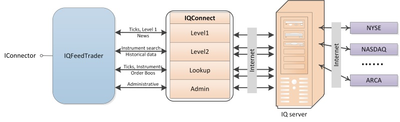
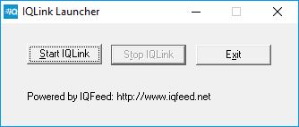
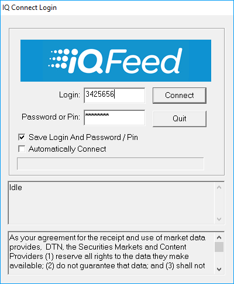

# Configuration IQFeed

The interaction mechanism is shown in this figure: 

To work with the **iQFeed** connector, you need to install the **IQ Feed Client** router on the computer, which can be installed on both the local computer and the remote one. Data exchange between the client application and the **IQ Feed Client**, as well as between the **IQ Feed Client** and the servers, is performed via the TCP\/IP protocol. 

To download the **IQ Feed Client** from the [iQFeed](http://www.iqfeed.net/) site, you must first authorize using the password and login received from **iQFeed**.

After installing **IQ Feed Client**, it is recommended to restart the computer.

After installing **IQ Feed Client, IQLink Launcher** must be started.

In the **IQLink Launcher** window that opens, click **Start IQLink**.

In the opened **IQ Connect Login** window it is necessary to enter the **Login** and **Password** (or PIN) received from the **iQFeed** service, in this case the Login and Password are not the Login and Password from the **iQFeed** site. After filling in Login and Password, you have to click **Connect** to connect.

To receive data, the client application uses four connections through different ports: 

1. Level1 (port 5009) is used to get real\-time data on instruments (ticks, opening and closing prices, volatility, etc.) and news.
2. Level2 (port 9200) is used to get extended quotes for instruments, for each ECN you can get the best pair of quotes.
3. Lookup (port 9100) is used to search for instruments, retrieve historical data, get advanced information on news.
4. Admin (port 9300) is used to get general information about connection and changing settings.

The port numbers that are used by default for connection to the **IQ Feed Client** are specified in brackets. For client connections, the port numbers can be changed in the registry, for example, for Level1 on the following path: \[HKEY\_CURRENT\_USER\\SOFTWARE\\DTN\\IQFEED\\Startup\\Level1Port\]. Port numbers for connecting to IQ servers can not be changed. 
