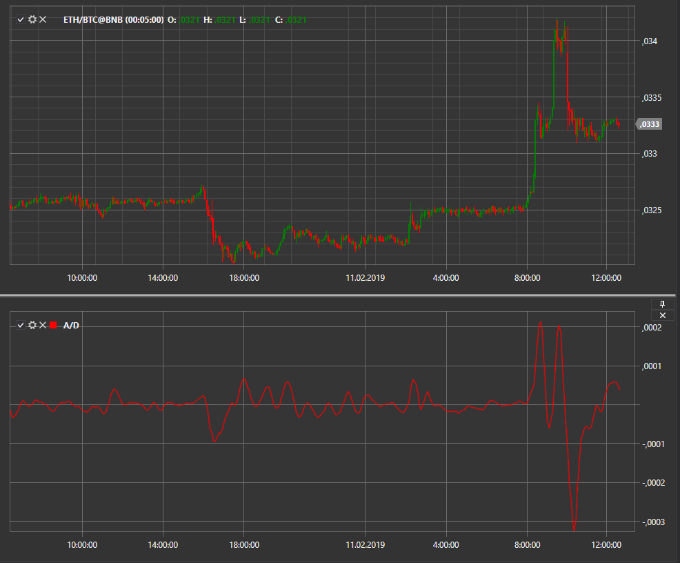

# A\/C

**Acceleration\/Deceleration (A\/C)** is an oscillator created by Bill Williams. It measures the acceleration and deceleration of the trend momentum. 

To use the indicator, you must use the [Acceleration](xref:StockSharp.Algo.Indicators.Acceleration) class. 

## Recommended content

[Alligator](IndicatorAlligator.md)
