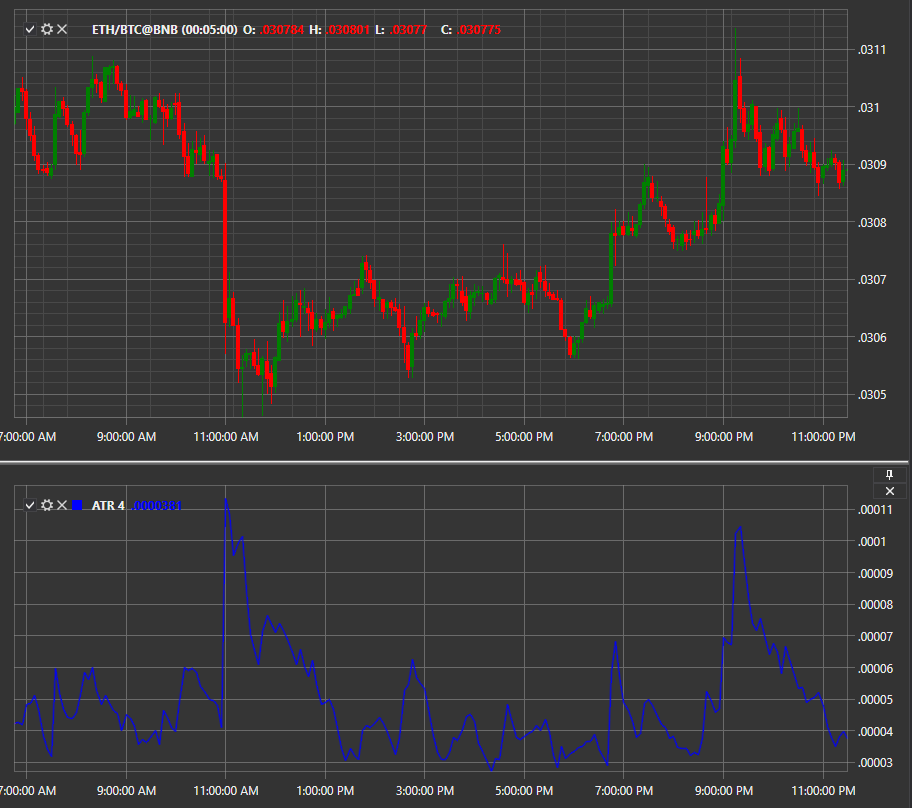

# ATR

**Average True Range (ATR)** is an indicator showing the current volatility level. 

To use the indicator, you must use the [AverageTrueRange](../api/StockSharp.Algo.Indicators.AverageTrueRange.html) class. 

## Recommended content

[AO](IndicatorAwesomeOscillator.md)
