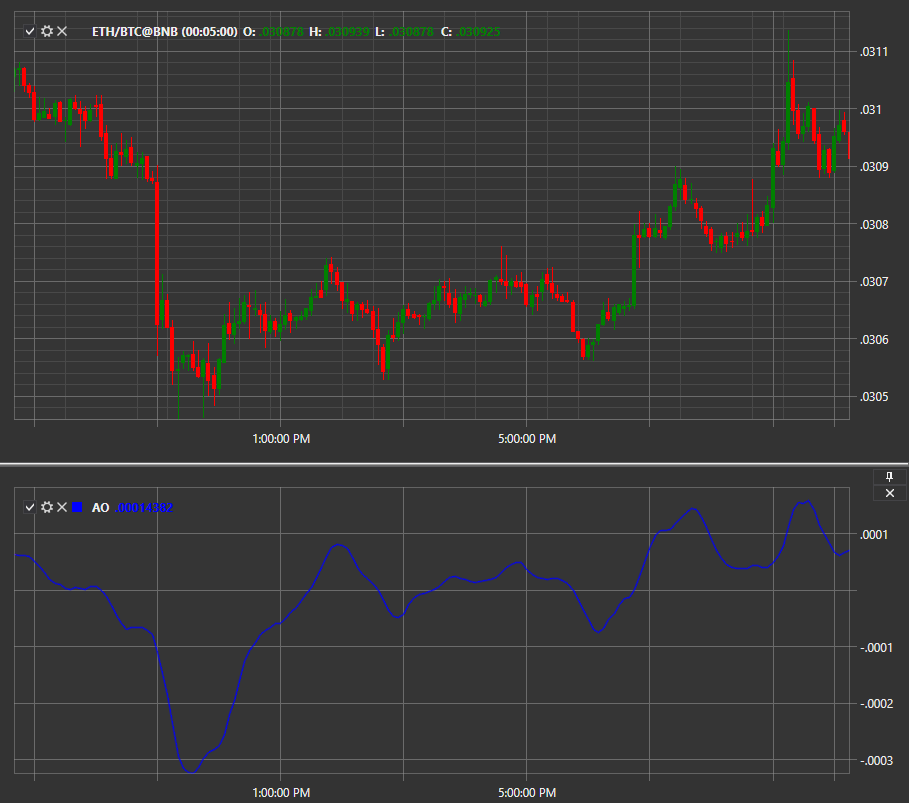

# AO

Awesome Oscillator (AO) is a classic technical indicator built by subtracting moving averages (SMA) with different periods. 

To use the indicator, you must use the [AwesomeOscillator](../api/StockSharp.Algo.Indicators.AwesomeOscillator.html) class. 

## Recommended content

[Bollinger Bands](IndicatorBollingerBands.md)
