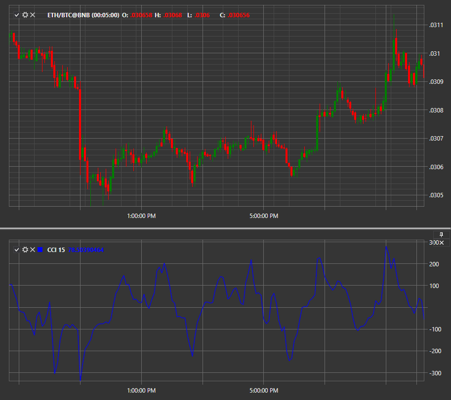

# CCI

**Commodity Channel Index (CCI)** is a technical indicator based on the analysis of the current price deviation from its average value and the statistically average absolute value. 

To use the indicator, you must use the [CommodityChannelIndex](../api/StockSharp.Algo.Indicators.CommodityChannelIndex.html) class. 

## Recommended content

[DPO](IndicatorDetrendedPriceOscillator.md)
