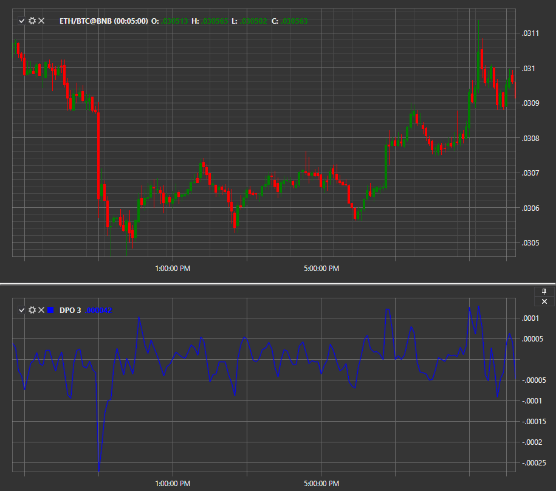

# DPO

**Detrended Price Oscillator (DPO)** is an oscillator that eliminates price trends in an attempt to estimate the duration of price cycles from peak to peak or trough to trough. Unlike other oscillators, such as stochastic convergence or moving average convergence divergence (MACD), DPO is not a momentum indicator. It highlights peaks and troughs in price, which are used to estimate entry and exit points.

To use the indicator, the [DetrendedPriceOscillator](xref:StockSharp.Algo.Indicators.DetrendedPriceOscillator) class should be used.

The Detrended Price Oscillator is calculated by subtracting a simple moving average (SMA) from the current price value. The length of the moving average is determined by the user.

## See Also

[DMI](IndicatorDirectionalIndex.md)
