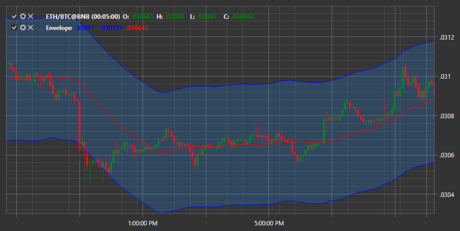

# Envelope

**Envelope** \- indicator which is a channel created by shifting the moving average by a certain value. 

To use the indicator, you must use the [Envelope](xref:StockSharp.Algo.Indicators.Envelope) class. 

## Recommended content

[EMA](IndicatorExponentialMovingAverage.md)
