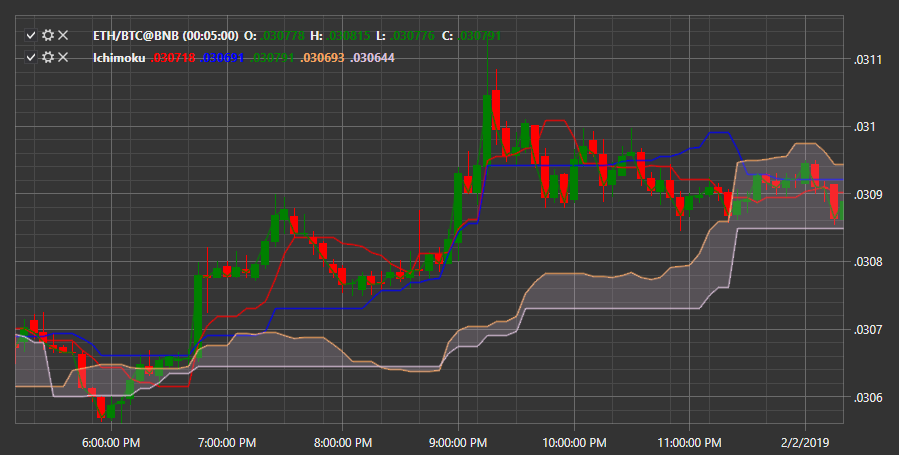

# Ichimoku

**Ichimoku** is an indicator represented by a combination of five lines, three of which are moving averages and two are their derivatives. Ichimoku determines if there is a trend, and also indicates support\/barrier zones and trend rollbacks. 

To use the indicator, you must use the [Ichimoku](../api/StockSharp.Algo.Indicators.Ichimoku.html) class. 

## Recommended content

[JMA](IndicatorJurikMovingAverage.md)
