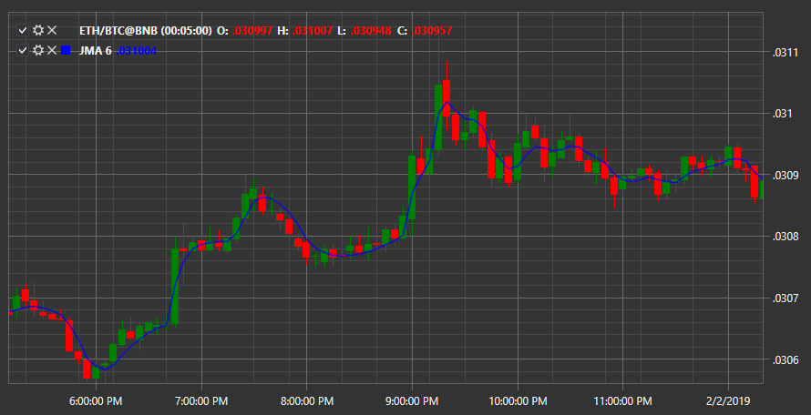

# JMA

**Jurik’s Moving Average (JMA)** indicator is a type of moving average. The indicator curve is characterized by a good smoothing, as well as a minimum advance after the end of price movements and a minimum lag from strong price movements. 

To use the indicator, you must use the [JurikMovingAverage](../api/StockSharp.Algo.Indicators.JurikMovingAverage.html) class. 

## Recommended content

[KAMA](IndicatorKaufmannAdaptiveMovingAverage.md)
