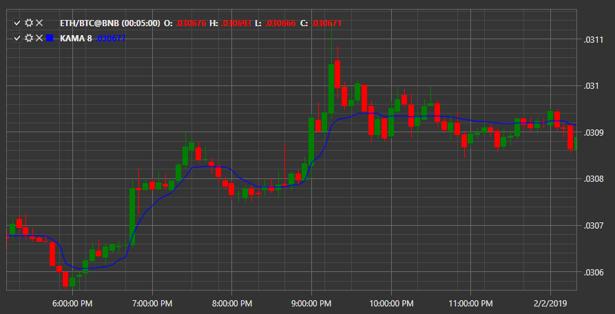

# KAMA

**Kaufman's Adaptive Moving Average (AMA, KAMA, AMkA)** was developed by Perry Kaufman to account for market noise and volatility. The KAMA indicator can be used to determine reversal points in time, determine the overall trend and filter price movements. 

To use the indicator, you must use the [KaufmannAdaptiveMovingAverage](../api/StockSharp.Algo.Indicators.KaufmannAdaptiveMovingAverage.html) class. 

## Recommended content

[KAMA](IndicatorKaufmannAdaptiveMovingAverage.md)
