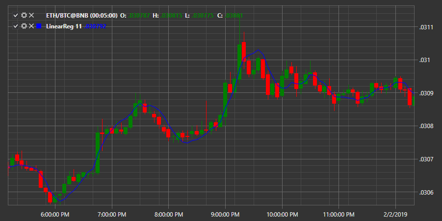

# LRC

**Linear Regression Curve (LRC)** is a type of moving average based on the linear regression equation. The calculation result is a straight line with the best fit for different prices for the period. The end point of this line is used to plot the LRC. 

To use the indicator, you must use the [LinearReg](../api/StockSharp.Algo.Indicators.LinearReg.html) class. 

## Recommended content

[Logging](Logging.md)
