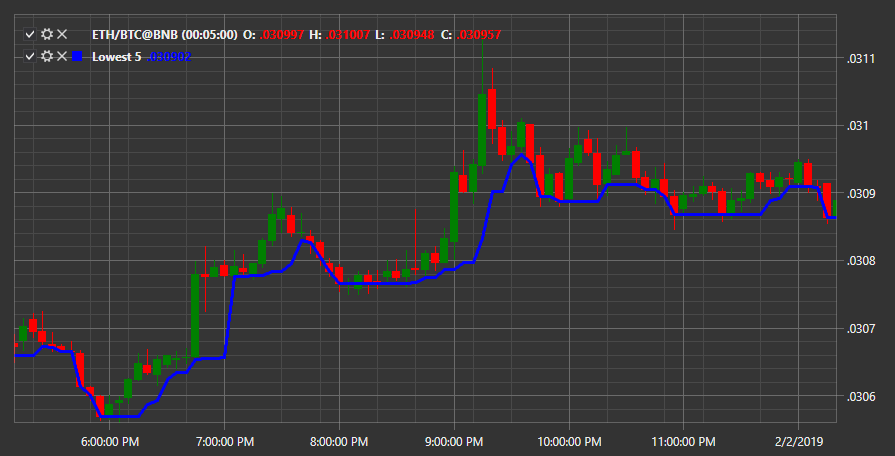

# Lowest 

The indicator indicates the **Minimum value for the period**. 

To use the indicator, you must use the [Lowest](../api/StockSharp.Algo.Indicators.Lowest.html) class. 

## Recommended content

[Lowest ](IndicatorLowest.md)
